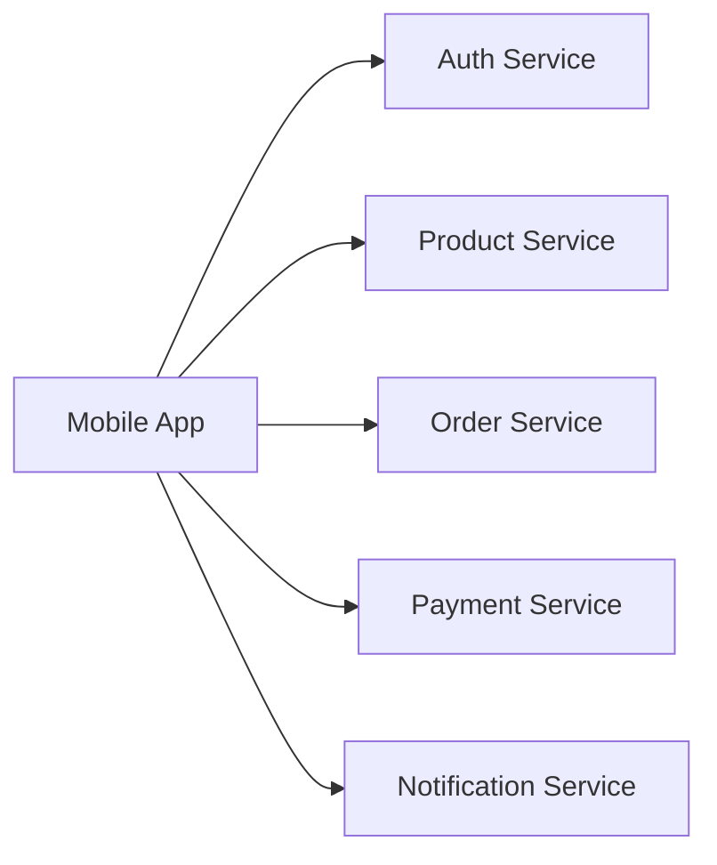
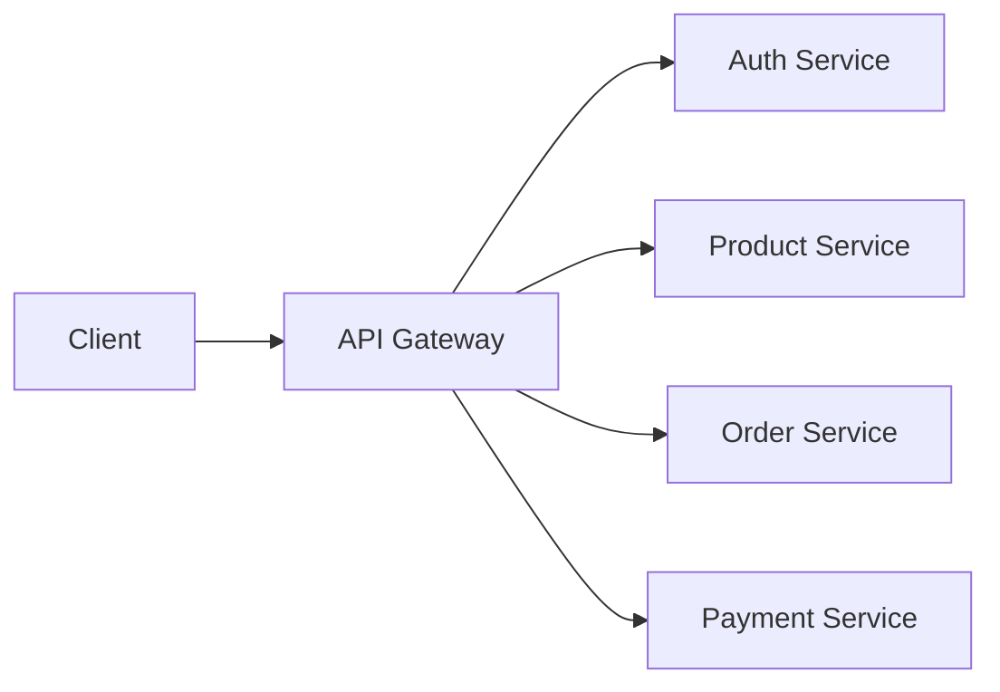
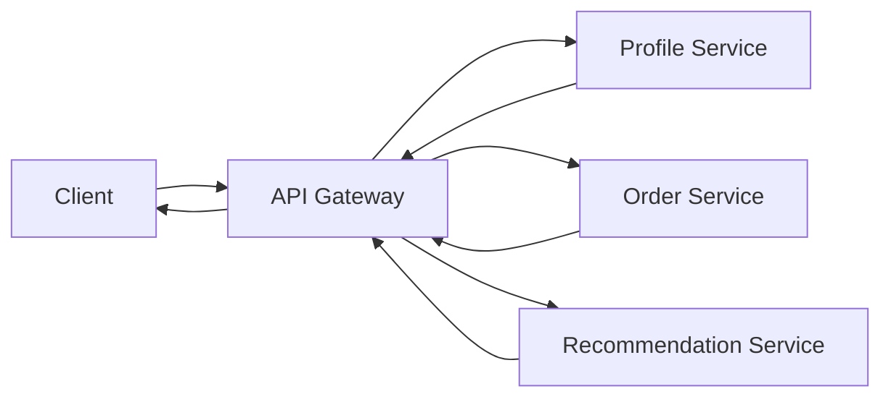

## API Gateway Pattern: The Front Door of Modern Systems

Imagine you're building an e-commerce platform.

Initially you have:

- one application
- one API
- one deployment

Life is simple.

Clients send requests.

The application responds.

But as the system grows:

you introduce:

- Authentication Service
- Product Service
- Order Service
- Payment Service
- Notification Service

Now things become more complicated.

A simple mobile app screen might need data from:

- authentication
- products
- recommendations
- orders

all at the same time.

The architecture starts becoming difficult to manage.

This is the problem the API Gateway pattern was designed to solve.

---

### The Problem Before API Gateways

Imagine a client directly communicating with every service.



At first glance:

this seems reasonable.

But problems quickly emerge.

---

### Problem 1: Too Many Network Calls

Suppose a dashboard requires:
- user profile
- recent orders
- recommendations
- loyalty points

The client may need

4-10 API calls.

This increases:
- latency
- network overhead
- client complexity

The user experience suffers.

---

### Problem 2: Authentication Everywhere

Every service now needs to handle:
- authentication
- authorization
- token validation

This creates duplication.

Soon:

every team starts solving the same problem repeatedly.

---

### Problem 3: Inconsistent APIs

Different teams often build APIs differently.

Examples:
```text
/users

/api/users

/v1/users

/getUsers
```

Clients must handle inconsistencies.

The system becomes harder to maintain.

---

### Problem 4: Security Becomes Hard

Exposing every service publicly means:
- larger attack surface
- more security configurations
- more opportunities for mistakes

This becomes risky at scale.

---

### Enter the API Gateway

Instead of exposing every service:

we introduce a single entry point.



Now clients only communicate with the gateway.

The gateway communicates with internal services.

---

### What Exactly Is an API Gateway?

An API Gateway is:

> A centralized layer that sits between clients and backend services.

It acts as:
- traffic controller
- security layer
- routing engine
- aggregation layer

The client sees one system.

Behind the scenes many services may exist.

---

### Real-World Analogy: Airport Security

Imagine an international airport.

Without centralized security:

every airline would:
- verify identity
- inspect luggage
- enforce policies

This would create chaos.

Instead:

all passengers pass through a central checkpoint.

Only then are they routed to destinations.

An API Gateway works similarly.

---

### Core Responsibilities of an API Gateway

---

**1. Request Routing**

The most basic responsibility.

Examples:

```text
/api/products
```

gets routed to:

```text
Product Service
```

While:

```text
/api/orders
```

goes to:

```text
Order Service
```

Clients don't need to know where services live.

---

**2\. Authentication and Authorization**

One of the most valuable benefits.

Instead of:

every service validating tokens,

the gateway performs validation once.


This centralizes security.

---

**3\. Rate Limiting**

Suppose a malicious user sends:

100,000 requests per minute.

Without protection:

services may collapse.

The gateway can enforce:
- request limits
- quotas
- abuse prevention

before traffic reaches backend systems.

---

**4\. Request Aggregation**

One of the most powerful features.

Suppose a dashboard needs:
- profile
- orders
- recommendations

Without a gateway:

the client makes multiple calls.

With aggregation:



The client receives one response.

Latency often improves significantly.

---

**5\. Monitoring and Observability**

Gateways become strategic observation points.

They can measure:
- request volume
- latency
- errors
- traffic patterns

This provides valuable operational visibility.

---

### Why Large Companies Use API Gateways

As organizations grow:

so do services.

A company may have:
- hundreds of services
- thousands of APIs
- dozens of teams

Managing this without a gateway becomes extremely difficult.

This is why gateways became a foundational pattern in microservice architectures.

---

### The Hidden Cost of API Gateways

Like every architectural pattern:

API Gateways solve problems.

But introduce new ones.

---

### Single Point of Failure

If the gateway fails:

everything behind it becomes unreachable.


This is why production gateways are typically:
- replicated
- highly available
- load balanced

---

### Increased Complexity

The gateway itself becomes a system.

Now teams must manage:
- routing rules
- security policies
- traffic management
- monitoring

Poorly designed gateways become bottlenecks.

---

### Gateway Bloat

A common mistake:

putting business logic inside the gateway.

Over time it becomes:
- difficult to maintain
- difficult to scale
- difficult to debug

A gateway should coordinate.

Not become another monolith.

---

### Evolution of Communication Patterns

Most systems evolve like this:

```text
Monolith
    ↓
Few Services
    ↓
Many Services
    ↓
API Gateway
    ↓
Service Mesh
```

The gateway is often one of the first major architectural patterns adopted during microservice growth.

---

### When Should You Use an API Gateway?

Good candidates:
- microservice architectures
- multiple client applications
- centralized authentication needs
- API management requirements

Poor candidates:
- simple monoliths
- very small systems
- early-stage applications

Remember:

architecture should solve current problems.

Not hypothetical future ones.

---

### Practical Engineering Mindset

When evaluating an API Gateway ask:
- Do clients call many services?
- Is authentication duplicated?
- Are APIs becoming inconsistent?
- Is observability difficult?
- Are teams growing?

If the answer is yes:

an API Gateway may be valuable.

---

### The Bigger Lesson

The API Gateway pattern teaches an important architectural principle:

> Complexity should be hidden behind stable interfaces.

Clients should not need to understand:
- service locations
- deployment topology
- internal architecture

They should simply consume functionality.

The gateway becomes the abstraction layer that makes this possible.

---

### Final Takeaway

API Gateways are one of the most important patterns in modern distributed systems.

They help systems:
- centralize security
- simplify communication
- improve observability
- reduce client complexity

But they must be designed carefully.

Because every abstraction eventually becomes infrastructure.

And infrastructure eventually becomes critical.

Understanding this pattern is the first step toward understanding how large microservice architectures stay manageable as they grow.

---

### In the Next Blog

Now that we understand how clients communicate with large distributed systems, the next question becomes:

> How do services find each other when servers are constantly being created, destroyed, and moved?

In the next article, we'll explore the Service Discovery Pattern, and understand how modern distributed systems dynamically locate and communicate with services at scale.
