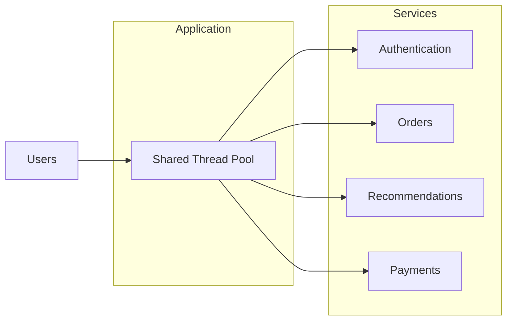
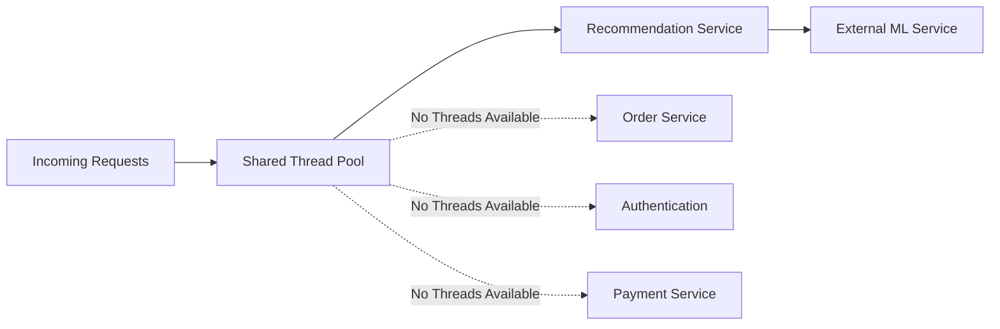
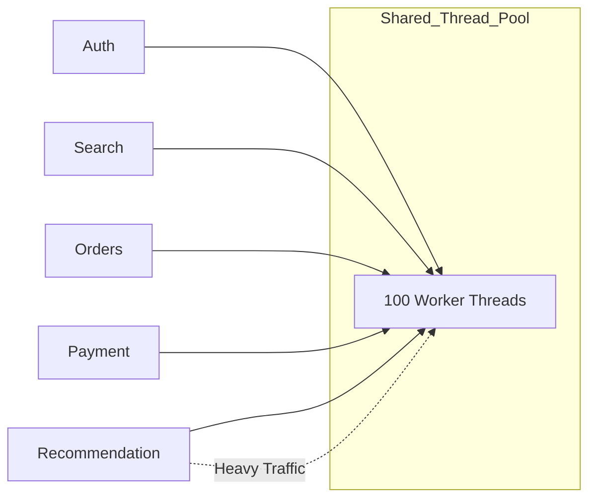
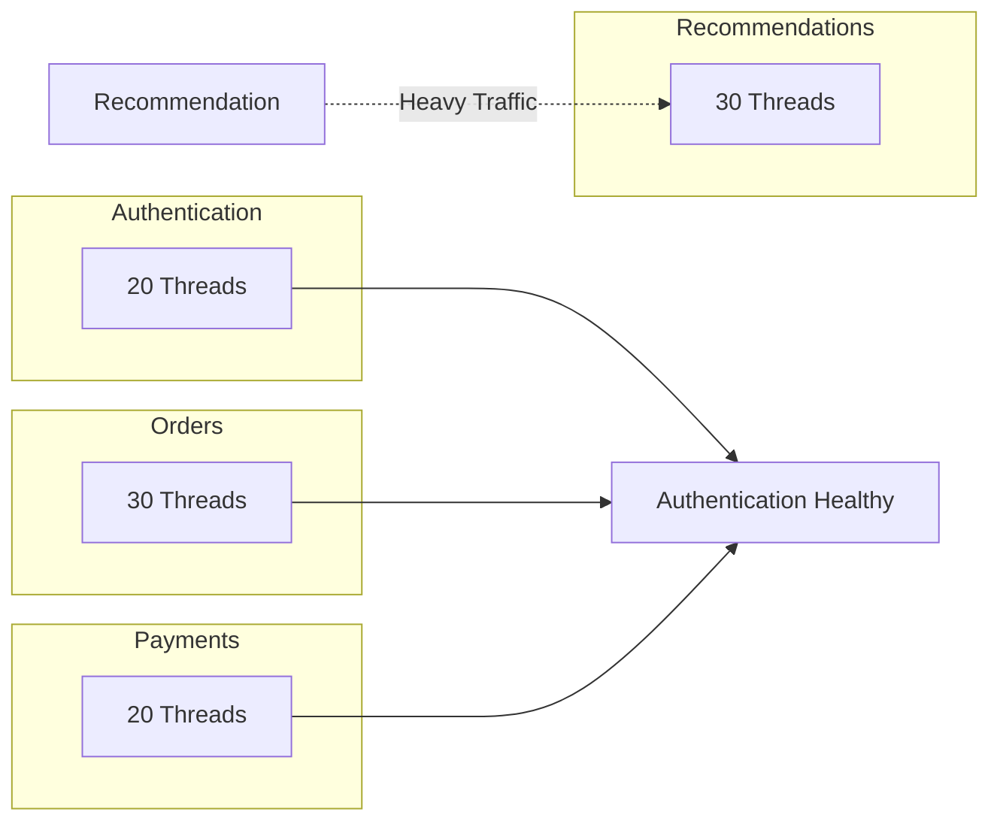
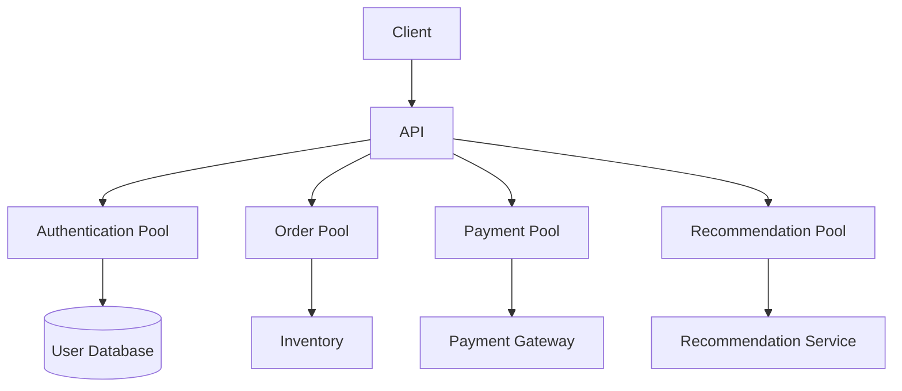
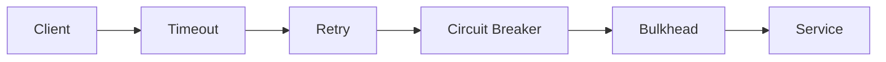

## Bulkhead Pattern: Why One Failing Service Shouldn't Sink Your Entire System

**Previously...**

Over the last three articles, we've explored how distributed systems deal with unreliable communication.

- **Timeouts** define how long we're willing to wait.
- **Retries** decide when another attempt is worthwhile.
- **Circuit Breakers** temporarily stop requests from reaching unhealthy services.

Together, these patterns help control _time_.

But resilience isn't only about time.

It's also about **resources**.

Even with well-configured timeouts and retries, a single overloaded component can still consume every available thread, connection, or worker process. When that happens, healthy parts of the application begin failing not because they're broken, but because they can no longer obtain the resources they need.

The next question, therefore, isn't _"How long should we wait?"_

It's:

**"How do we stop one component from consuming everything?"**

---

### What You'll Learn

By the end of this article, you'll understand:

- Why resource isolation is essential in distributed systems.
- How one overloaded dependency can affect unrelated features.
- The motivation behind the Bulkhead Pattern.
- How resource pools prevent cascading failures.
- Common implementation mistakes and trade-offs.

---

### A Production Incident

Imagine an e-commerce platform during a festive sale.

The application provides several independent features:

- Product Search
- User Authentication
- Order Processing
- Recommendations
- Payment Processing

Everything appears healthy until the Recommendation Service experiences an unexpected traffic spike.

Generating personalized recommendations requires multiple database queries and calls to an external machine learning service. Response times increase dramatically, causing hundreds of requests to remain active much longer than expected.

Within minutes, engineers notice something surprising.

Customers can no longer log in.

Order placement becomes unreliable.

Even though the authentication service and order service are functioning correctly, users experience failures across the platform.

The recommendation engine didn't fail the system directly.

It consumed resources that every other feature depended on.

---

### Why This Happened

Many applications begin with a shared execution model.

Every incoming request is handled by the same thread pool.

Every feature competes for the same worker processes.

Every service shares the same connection pool.

At first, this seems efficient because idle resources can be used by any request.

However, shared resources also introduce shared risk.

If one feature suddenly requires significantly more threads than expected, it doesn't just slow itself down.

It prevents other parts of the application from obtaining resources altogether.

This is one of the most common causes of cascading failures in distributed systems.

---

### Shared Resources: The Hidden Bottleneck

The architecture might initially look like this.

At first glance, this seems perfectly reasonable.

Every feature simply borrows a worker thread whenever it needs one.

The problem only appears when one workload behaves unexpectedly.

---

### When One Service Consumes Everything

Suppose the Recommendation Service suddenly receives thousands of expensive requests.

The shared thread pool gradually fills up.

Notice what's happening.

Authentication isn't slow.

Payments aren't overloaded.

Orders are functioning normally.

Yet all three begin failing because they can no longer obtain worker threads.

The problem isn't the services.

The problem is the shared resource.

---

### Real-World Analogy

The name "Bulkhead" comes from ship design.

Large ships are divided into multiple watertight compartments called **bulkheads**.

If one compartment is damaged and begins taking on water, the doors between compartments remain sealed.

The damaged section floods.

The rest of the ship stays afloat.

Without those compartments, a small leak could flood the entire vessel.

Distributed systems face a remarkably similar problem.

Instead of water spreading through a ship, resource exhaustion spreads through an application.

The solution is the same:

**Create boundaries so failures remain isolated.**

---

### Why This Problem Became More Important

In monolithic applications, resource contention certainly existed, but failures were often localized because there were fewer remote dependencies and less concurrency.

Modern distributed systems are different.

A single user request might involve:

- Authentication
- Inventory
- Payment
- Fraud Detection
- Notification
- Recommendation

Each step competes for limited resources.

As architectures become more distributed, protecting those resources becomes just as important as protecting the services themselves.

---

### The Solution: Isolate Resources Instead of Sharing Everything

The production incident that exposed an important weakness in the application's architecture. Every feature-authentication, search, checkout, recommendations, and payments-depended on the same pool of worker threads. As long as traffic remained balanced, this worked well. However, once a single component started consuming more resources than expected, every other feature paid the price.

The Bulkhead Pattern solves this problem by changing the way resources are allocated.

Instead of allowing every component to compete for the same pool, each critical feature receives its own dedicated resources. If one feature becomes overloaded, it can only exhaust its own allocation. The remaining parts of the application continue operating normally.

The goal isn't to prevent failures. The goal is to **contain** them.

---

### Why It's Called the Bulkhead Pattern

The name comes from shipbuilding.

Large ships are divided into watertight compartments called **bulkheads**. If one section of the ship is damaged and begins filling with water, the doors between compartments remain sealed. Water is prevented from spreading throughout the vessel, allowing the rest of the ship to remain afloat.

The same principle applies to distributed systems.

Instead of isolating water, we isolate resources such as:

- Worker threads
- Connection pools
- CPU quotas
- Memory
- Network bandwidth

Rather than allowing one overloaded service to consume everything, we create boundaries that limit how much damage any single component can cause.

---

### Shared Pool vs Isolated Pools

Without resource isolation, every feature competes for the same execution resources.

This architecture maximizes resource utilization, but it also creates a single point of contention.

Now compare that with isolated pools.

Here, the Recommendation Service can only consume its own allocation. Even if its thread pool becomes exhausted, authentication, payments, and order processing remain unaffected.

---

### Resource Isolation Isn't Limited to Threads

Many engineers associate the Bulkhead Pattern only with thread pools.

In practice, almost any shared resource can become a bottleneck.

Common examples include:

| Resource             | Isolation Strategy                                  |
| -------------------- | --------------------------------------------------- |
| Worker Threads       | Separate thread pools                               |
| Database Connections | Dedicated connection pools                          |
| HTTP Clients         | Independent connection pools per downstream service |
| CPU                  | CPU quotas or cgroup limits                         |
| Memory               | Memory limits per container or process              |
| Message Consumers    | Independent consumer groups                         |

The principle remains the same regardless of the resource: isolate consumption so that one workload cannot starve another.

---

### Design Challenge

Imagine you're building a food delivery platform.

The application contains four independent features:

- Order Placement
- Restaurant Search
- Delivery Tracking
- Recommendation Engine

During a major sporting event, recommendation traffic suddenly increases by fifteen times because users are browsing restaurants more frequently.

Would you rather:

- Share all resources and maximize utilization during normal traffic?
- Or reserve dedicated resources for each feature, accepting that some capacity may remain unused?

There isn't a universally correct answer. The decision depends on whether you value maximum utilization or predictable availability more highly.

---

### Thread Pool Bulkhead

One of the most common implementations is thread isolation.

Each service receives its own worker pool.

If the recommendation requests begin queueing, only the Recommendation Pool becomes saturated.

The remaining pools continue processing requests independently.

---

### Semaphore Bulkhead

Not every application creates separate thread pools.

Another common approach is to limit concurrency using semaphores.

Instead of assigning dedicated threads, a semaphore simply limits how many requests may enter a particular operation simultaneously.

For example:

- Maximum 50 concurrent payment requests
- Maximum 100 recommendation requests
- Maximum 20 inventory updates

Once the limit is reached, additional requests must wait or fail gracefully.

This approach generally consumes fewer resources while still preventing uncontrolled concurrency.

---

### Thread Pool vs Semaphore Bulkheads

| Thread Pool Bulkhead           | Semaphore Bulkhead                     |
| ------------------------------ | -------------------------------------- |
| Separate worker threads        | Shared workers with concurrency limits |
| Strong isolation               | Lightweight isolation                  |
| Higher memory usage            | Lower memory usage                     |
| Better for blocking operations | Better for asynchronous workloads      |

Neither approach is universally better.

The right choice depends on your application's execution model.

---

### How Bulkheads Work with Other Resilience Patterns

Bulkheads are rarely deployed alone.

They complement the patterns we've already discussed.

Each pattern solves a different problem.

| Pattern         | Responsibility                                        |
| --------------- | ----------------------------------------------------- |
| Timeout         | Stop waiting forever                                  |
| Retry           | Recover from transient failures                       |
| Circuit Breaker | Stop calling unhealthy services                       |
| Bulkhead        | Prevent one workload from exhausting shared resources |

Together they create a layered resilience strategy.

---

### Production Considerations

The Bulkhead Pattern significantly improves fault isolation, but it isn't free.

Creating independent pools introduces operational decisions that need continuous monitoring.

Some of the most common considerations include:

**Capacity Planning**

How many threads should each pool receive?

Allocating too few resources causes unnecessary bottlenecks.

Allocating too many wastes capacity.

Finding the right balance often requires analyzing production traffic rather than relying on fixed rules.

---

**Uneven Workloads**

Different features rarely experience identical traffic.

A recommendation engine may receive bursts during promotional events, while authentication traffic remains relatively stable.

Resource allocations should reflect actual usage patterns rather than dividing capacity equally.

---

**Monitoring**

Isolated resources introduce new metrics to monitor.

Teams typically track:

- Thread pool utilization
- Queue length
- Request rejection rate
- Average wait time
- Pool saturation percentage

These metrics often reveal resource exhaustion long before customers notice performance problems.

---

### Common Mistakes

**Creating Too Many Pools**

Over-isolation increases operational complexity and can leave resources idle.

Not every endpoint requires its own dedicated pool.

---

**Ignoring Capacity Planning**

Simply creating separate thread pools doesn't guarantee resilience.

Incorrect pool sizes can still become bottlenecks.

---

**Isolating Everything**

Bulkheads should protect critical workloads.

Applying isolation indiscriminately makes systems harder to manage without providing proportional benefits.

---

**Forgetting Downstream Dependencies**

Even if your application isolates worker threads, a shared database connection pool can still become the single point of contention.

Resource isolation should be considered across the entire request path.

---

### When Should You Use the Bulkhead Pattern?

The Bulkhead Pattern is particularly valuable when:

- Different features have different priorities.
- Some workloads are significantly more expensive than others.
- Traffic spikes are common.
- One failing component must not affect customer-critical functionality.
- Services communicate extensively with external dependencies.

It may be unnecessary for very small applications where resource contention is unlikely.

---

### Key Takeaways

The Bulkhead Pattern is fundamentally about resource isolation.

Rather than allowing every component to compete for the same pool of threads, connections, or CPU time, it establishes clear boundaries between workloads. Those boundaries ensure that localized failures remain localized, improving both availability and predictability.

Like the other resilience patterns we've explored, Bulkheads don't eliminate failures. They simply prevent one failure from becoming everyone else's problem.

---

### Next Up

So far we've focused on protecting services from failures caused by communication delays, retries, unhealthy dependencies, and resource exhaustion.

But many production systems face a different challenge altogether.

A single request often needs data owned by multiple services.

Should every request call each service directly?

Or should frequently requested data be stored closer to where it's needed?

In the next article, we'll explore the **Cache-Aside Pattern**, one of the most widely used caching strategies in distributed systems, and learn how it reduces latency while protecting backend services from unnecessary load.
