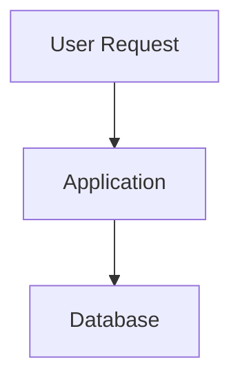
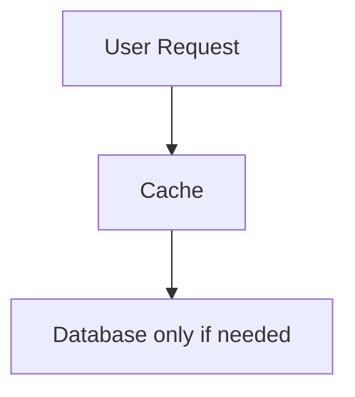
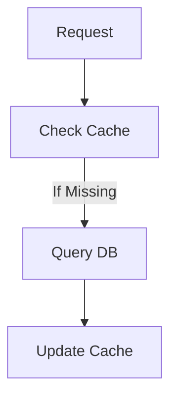

## Caching: Why Every Large System Avoids Repeating Expensive Work

Imagine millions of users opening Instagram at the same time.

Every user:

- loads feeds
- opens profiles
- watches stories
- refreshes content repeatedly

Now think about what would happen if:

👉 every request directly hit the database.

Very quickly:

- databases would overload
- latency would increase
- systems would slow down
- costs would explode

Yet platforms like:

- YouTube
- Netflix
- Instagram
- Amazon

continue serving enormous traffic smoothly.

Why?

Because large systems learn one important lesson very early:

> Repeating expensive work at scale is dangerous.

This is why caching exists.

---

### The Core Idea Behind Caching

Caching is surprisingly simple.

> Store frequently used data somewhere faster so the system does not recompute or refetch it repeatedly.

Instead of:

You introduce:

Now:

- most requests are served quickly
- databases receive less traffic
- systems become faster and more scalable

---

### Why Databases Become Bottlenecks So Quickly

Databases are expensive systems.

Not financially. Operationally.

Every database query involves:

- parsing requests
- searching indexes
- reading memory
- disk I/O
- locking rows
- managing concurrency

A single query may feel fast. But millions of queries? That changes everything.

---

### Real-World Example: YouTube Video Views

Suppose a viral video suddenly gets:

- 10 million views in one hour

Without caching:

Every page refresh would repeatedly query:

- title
- views
- likes
- comments
- recommendations

The database would become overwhelmed almost instantly.

Instead:
YouTube caches heavily accessed content closer to users. This dramatically reduces load.

---

### Real Systems Care More About Repeated Reads Than Writes

A critical observation in system design:

Most systems receive:

- far more reads than writes

Example:

A celebrity posts once.

Millions read that post.

This imbalance creates the perfect use case for caching.

---

### Real-World Analogy: Restaurant Kitchen

Imagine a restaurant.

Without preparation:

- every order starts from zero
- vegetables cut repeatedly
- sauces prepared repeatedly

Service becomes slow.

Now imagine:

- ingredients pre-prepared
- commonly used items ready instantly

Orders become faster. That pre-preparation is caching. The kitchen avoids repeating expensive work.

---

### Why Caching Feels “Magically Fast”

Memory is dramatically faster than databases.

Approximate speed comparison:

| Storage Type       | Speed               |
| ------------------ | ------------------- |
| CPU Cache          | Nanoseconds         |
| RAM (Redis Cache)  | Microseconds        |
| SSD Database Reads | Milliseconds        |
| Network Requests   | Higher Milliseconds |

Even tiny delays matter at scale.

Saving:
- 50ms per request

across millions of users becomes enormous.

---

### The First Big Lesson

Caching is not just about speed.

It is about:
- reducing pressure on systems
- improving scalability
- preventing bottlenecks
- controlling infrastructure costs

This mindset is extremely important.

---

### Types of Caching in Real Systems

Most beginners think caching means:

👉 “Use Redis”

But real systems use caching at multiple layers.

---

**1\. Browser Cache**

The simplest cache.

Your browser stores:
- images
- CSS
- JavaScript
- fonts

So repeated visits avoid downloading assets again.

This reduces:
- bandwidth
- server load
- latency

---

**2\. CDN (Content Delivery Network)**

One of the most important scaling technologies on the internet.

CDNs store content geographically closer to users.

Example:

A user in India opening Netflix should not fetch video data from the US every time.

Instead:
- content is cached in nearby edge servers

This reduces:
- latency
- network congestion
- global infrastructure load

---

### Why CDNs Matter So Much

Distance creates latency.
Even light takes time to travel.

At global scale:

> Physics itself becomes a system design challenge.

CDNs reduce physical distance between:
- users
- content

This is one reason modern internet systems feel fast globally.

---

**3\. Application Cache**

This is where tools like:
- Redis
- Memcached

become important.

Applications cache:
- user sessions
- feeds
- recommendations
- frequently accessed queries

instead of repeatedly querying databases.

---

**4\. Database Cache**

Databases themselves also cache:
- indexes
- query results
- frequently accessed pages

Modern databases heavily optimize around caching internally. Because disk access is expensive.

---

### Cache Hits vs Cache Misses

This is one of the most important metrics in caching systems.

---

### Cache Hit

Requested data exists in cache.

Result:

👉 very fast response

---

### Cache Miss

Data not found in cache.

System must:
- query database
- compute result
- populate cache

This is slower.

---

### Why Cache Hit Rate Matters

If your cache hit rate is:
- 95%

then:
👉 only 5% of requests hit the database.

This dramatically reduces load. Large-scale systems obsess over improving cache hit rates.

---

### The Hardest Problem in Caching

Caching sounds easy… Until data changes.

Example:
A user changes profile picture.

Now what?

The old cached version may still exist. Users may see outdated data. This introduces one of the hardest problems in distributed systems:

---

### Cache Invalidation

> “There are only two hard things in Computer Science: cache invalidation and naming things.”

Because now systems must decide:
- when to refresh cache
- when to remove cache
- how long data remains valid

---

### Common Cache Strategies

**Cache Aside (Most Common)**

Flow:

Simple and widely used.

---

**Write Through Cache**

When data updates:
- cache updates immediately
- database updates too

Ensures consistency. But increases write latency.

---

**Write Back Cache**

Data writes to cache first.

Database updates later asynchronously.

Very fast.

But riskier if cache crashes before DB sync.

---

### The Hidden Danger: Stale Data

Caching improves speed.

But introduces inconsistency.

Example:
- likes count outdated
- old feed data shown
- delayed updates

This is why system design is always about trade-offs.

Faster systems often tolerate temporary inconsistency.

---

**Distributed Caching Challenges**

At scale, caching itself becomes distributed.

Now new problems appear:
- cache synchronization
- replication
- eviction policies
- hotspot keys
- cache failures

Ironically:
👉 caching systems themselves become complex distributed systems.

---

**Hotspot Problem**

Suppose one celebrity post suddenly becomes viral.

Now:
- millions request same cache key

One cache server may become overloaded.
This is called a hotspot.

Large systems solve this using:
- replication
- partitioning
- distributed cache clusters

---

### Eviction Policies: What Gets Removed?

Caches cannot store infinite data.

Eventually:

👉 something must be removed.

Common eviction policies:
- LRU (Least Recently Used)
- LFU (Least Frequently Used)
- TTL expiration

These decisions heavily impact performance.

---

### Why Caching Changes Architecture

Once systems introduce caching:

architectures change dramatically.

Now systems become:
- faster
- more scalable
- more distributed
- eventually consistent

Caching becomes deeply connected to:
- databases
- APIs
- CDNs
- load balancing
- distributed systems

---

### Real-World Example: Instagram Feed

Imagine opening Instagram.

Without caching:
- every scroll triggers DB queries
- recommendation engine recomputes repeatedly
- media fetched repeatedly

Impossible at scale.

Instead:

Instagram caches aggressively at multiple layers:
- CDN for media
- Redis for feeds
- query caching
- recommendation caching

This reduces enormous computational cost.

---

### The Bigger Lesson

Caching teaches one of the most important ideas in system design:

> The fastest work is the work you avoid doing entirely.

Large-scale systems survive not because machines are infinitely powerful.

But because:

👉 they avoid unnecessary computation wherever possible.

---

### Final Takeaway

Caching is one of the foundational pillars of scalable systems.

It helps systems:
- reduce latency
- survive heavy traffic
- lower infrastructure pressure
- improve user experience

But it also introduces complexity:
- stale data
- invalidation challenges
- distributed synchronization problems

And this is the recurring pattern in system design:

> Every optimization solves one problem while introducing another.

Understanding these trade-offs is what separates:
- developers who build features

from:
- engineers who design systems.

---

### In the Next Blog

Now that we understand how systems reduce expensive repeated work, the next question becomes:

👉 Where does all the actual data live?

In the next article, we’ll explore Databases in System Design, and understand why large systems use different types of databases for different workloads instead of relying on a single solution.
