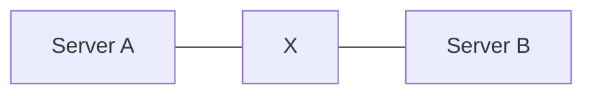

## CAP Theorem: Why Distributed Systems Can Never Have Everything

One of the biggest mindset shifts in system design happens when engineers realize:

> Distributed systems are fundamentally built around trade-offs.

Not because engineers are bad at optimization.

But because:

> Physics, networks, and distributed communication introduce unavoidable limitations.

This is where one of the most important concepts in distributed systems appears:

### CAP Theorem

Most beginners learn CAP as:

- Consistency
- Availability
- Partition Tolerance

Then memorize definitions for interviews.

But real engineering is much deeper.

CAP is not just theory.

It explains:

- why systems behave differently under failure
- why some apps show stale data
- why distributed databases make trade-offs
- why global-scale systems cannot guarantee everything simultaneously

Understanding CAP changes how you think about architecture permanently.

---

### The Real Problem CAP Tries to Solve

Imagine your system runs on:

- one server
- one database
- one machine

Life is simple.

No network communication exists between machines.

Now imagine scaling globally.

Your system now runs across:

- multiple servers
- multiple regions
- multiple databases

Suddenly:

- networks can fail
- messages can get delayed
- machines can disconnect

And this creates the central challenge of distributed systems:

> How do independent machines stay synchronized reliably?

That question is the heart of CAP theorem.

---

### Before CAP: The Illusion of Perfect Systems

Beginners often assume systems should always provide:

- perfectly fresh data
- zero downtime
- instant synchronization

But distributed systems operate in reality.

And reality includes:

- network latency
- packet loss
- regional outages
- hardware failures

Once systems distribute across machines:

> perfect guarantees become impossible.

CAP explains why.

---

### The Three Parts of CAP

---

**1. Consistency (C)**

Consistency means:

> Every user sees the same latest data at the same time.

Example:

You transfer money between accounts.

Immediately after transfer:

- every system
- every server
- every user

must see updated balance consistently.

No stale reads allowed.

---

**Strong Consistency Feels Predictable**

Strong consistency creates confidence.

Users trust:

- balances
- transactions
- inventory counts

Because data always appears synchronized.

This is critical in systems like:

- banking
- payment systems
- stock trading

Where incorrect data is dangerous.

---

**2. Availability (A)**

Availability means:

> The system always responds to requests.

Even during failures.

A response may not always contain the latest data.

But the system remains operational.

Example:

Instagram continues loading feeds even if some data is slightly outdated.

Users prefer:

- slightly stale data

over:

- complete downtime

---

**3. Partition Tolerance (P)**

This is the most misunderstood part.

Partition tolerance means:

> The system continues operating even when network communication between machines breaks.

Imagine:

The servers are alive.

But communication fails.

This is called a network partition.

And in distributed systems:

> partitions are inevitable.

Not rare.

Not theoretical.

Inevitable.

---

### The Most Important Reality

When a partition occurs:

you must choose between:

consistency
availability

Because you cannot guarantee both perfectly.

This is the actual meaning of CAP theorem.

---

### Real-World Example: Banking System

Suppose:

- Bank Server A
- Bank Server B

temporarily lose communication.

Now a user withdraws money.

Question:

Should the system:

---

**Option 1: Prioritize Consistency**

Block operations until synchronization succeeds.

Result:

no stale data
no incorrect balances

But:

some requests fail
users may experience downtime

This is CP behavior.

---

**Option 2: Prioritize Availability**

Allow operations to continue independently.

Result:

- system remains responsive

But:

- temporary inconsistencies may appear

This is AP behavior.

---

### Why Partition Tolerance Is Non-Negotiable

A very important insight:

In distributed systems:

> you do NOT choose whether partitions happen.

They WILL happen.

Because networks are unreliable.

So modern distributed systems effectively choose between:

- consistency
- availability

during network failures.

---

### CP Systems: Consistency First

CP systems prioritize:

- correct synchronized data

even if parts of the system become unavailable temporarily.

Examples:

- financial systems
- distributed locking systems
- metadata systems

These systems prefer:

> temporary unavailability over incorrect data.

Because incorrect data may be catastrophic.

---

### AP Systems: Availability First

AP systems prioritize:

- remaining operational

even if some data becomes temporarily inconsistent.

Examples:

- social media feeds
- recommendation systems
- analytics platforms

Because users usually tolerate:

- slightly stale information

more than total outage.

---

### The Internet Runs Mostly on Eventual Consistency

One of the biggest engineering realizations:

Most large-scale internet systems are not strongly consistent everywhere.

Instead they use:

**Eventual Consistency**

Meaning:

> Data may temporarily differ across systems, but eventually becomes synchronized.

Example:

You like a post.

One device shows:

- 101 likes

Another briefly shows:

- 100 likes

A few moments later:

- both synchronize

This trade-off dramatically improves scalability and availability.

---

### Why Global Scale Makes Consistency Harder

Imagine synchronizing data across:

- India
- US
- Europe
- Japan

Every update requires:

- network communication
- replication
- acknowledgment

Physics itself becomes a challenge.

Even light takes time to travel.

This is why globally distributed systems cannot always guarantee instant consistency.

---

### Real-World Example: Amazon Cart

Suppose:

- one replica briefly fails
- cart synchronization delays occur

Would Amazon rather:

- temporarily show an old cart?

or:

- completely stop shopping globally?

Most large systems choose availability for non-critical workflows.

Because business continuity matters.

---

### CAP Is About Failure Conditions

One common misunderstanding:

> CAP trade-offs matter specifically during partitions.

Under normal conditions:

systems often provide both:

- consistency
- availability

The difficult decisions happen during network failures.

And failures are inevitable at scale.

---

### Why Distributed Systems Became So Complex

Single-machine systems avoid many CAP problems.

But they cannot scale infinitely.

As systems distribute:

new challenges emerge:

- synchronization
- replication
- coordination
- network uncertainty

CAP theorem explains why distributed systems are fundamentally harder than local systems.

---

### Different Parts of the Same System May Choose Differently

Modern systems rarely choose one model globally.

Instead:

different components make different trade-offs.

Example:

Instagram may use:

| Component     | Preference           |
| ------------- | -------------------- |
| Payments      | Consistency          |
| Feed          | Availability         |
| Notifications | Availability         |
| User Settings | Stronger Consistency |

This is how real architectures evolve.

---

### The Bigger Lesson

CAP theorem teaches one of the deepest truths in engineering:

> Distributed systems are built around trade-offs, not perfection.

There is no architecture that guarantees:
- perfect consistency
- perfect availability
- perfect fault tolerance

simultaneously during network failures.

Every large-scale system chooses priorities based on business needs.

---

### Practical Engineering Mindset

Good engineers stop asking:

> “Which architecture is perfect?”

Instead they ask:
- What failures can happen?
- What inconsistencies are acceptable?
- What downtime is acceptable?
- Which guarantees matter most?

These questions shape real-world systems.

---

### Final Takeaway

CAP theorem is not merely an academic concept.

It explains:
- why distributed systems behave differently
- why global synchronization is difficult
- why eventual consistency exists
- why architectures make trade-offs

As systems scale:

> engineering becomes less about perfection and more about choosing the right compromises.

Understanding CAP is the beginning of truly understanding distributed systems.

---

### In the Next Blog

Now that we understand why distributed systems cannot guarantee everything simultaneously, the next question becomes:

👉If systems sacrifice strong consistency, how do users still experience reliable applications?

In the next article, we’ll explore Consistency Models, and understand how modern systems balance correctness, performance, and user experience at scale.