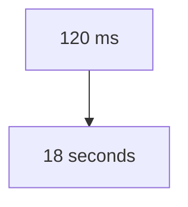
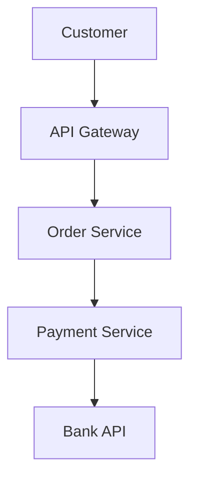
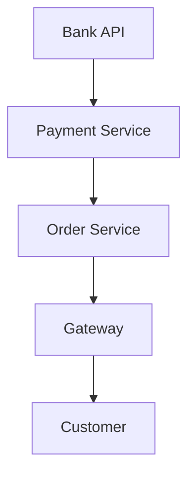
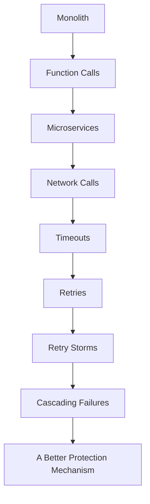
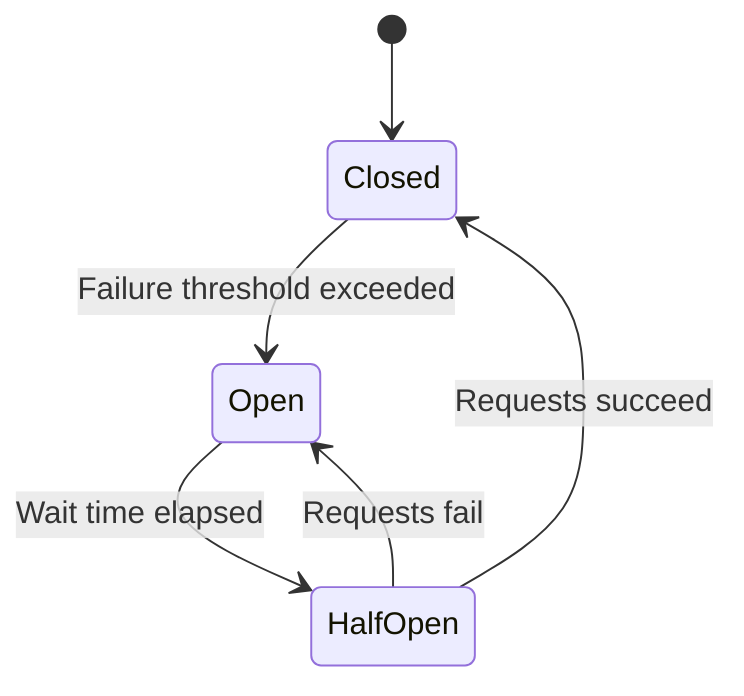
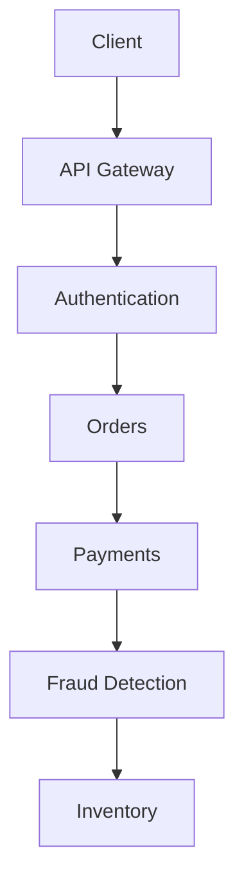

## Circuit Breaker Pattern: Why One Slow Service Can Bring Down Your Entire System

**Previously...**

Over the last few blogs, we've been transforming a simple application into a modern distributed system.

We learned why organizations move from monoliths to microservices.

Why each service should own its own database.

How the Saga Pattern keeps distributed transactions consistent.

Why CQRS separates reads from writes.

And finally, how Event Sourcing treats business events-not database rows-as the source of truth.

At this point, our services are independent.

They're scalable.

They're event-driven.

But they're also dependent on each other.

And dependency introduces something we've barely talked about until now.

**Failure.**

Not bugs.

Not bad code.

Simply...

One service becoming slow.

---

**It's 2:19 AM...**

Your phone vibrates.

Production alerts.

The Payment Service latency has jumped from:

It's not completely down.

It's just painfully slow.

You think:

> "That's okay. The Order Service will just retry."

And it does.

Every request that times out gets retried.

Then retried again.

Then again.

At first, this seems reasonable.

After all...

Maybe the next attempt will succeed.

But thousands of users are placing orders simultaneously.

Every failed request becomes:

Two requests.

Then three.

Then four.

Within minutes:

- CPU usage spikes.
- Thread pools fill up.
- Database connections become exhausted.
- Healthy services begin timing out.

Ironically...

The Payment Service didn't crash your platform.

Your retries did.

---

### A Failure That Spreads

Distributed systems rarely fail all at once.

They fail gradually.

Imagine this architecture.

Now suppose the Bank API slows down.

Payment Service waits.

Order Service waits for Payment.

API Gateway waits for Order.

Customer waits for API Gateway.

Every layer starts accumulating waiting requests.

Soon:

Everything appears broken.

Even though only one dependency became slow.

---

### This Is Called a Cascading Failure

Think of dominoes.

One falls.

Then another.

Then another.

The failure spreads.

Not because every service is broken.

Because every service is waiting.

---

### Why Waiting Is Dangerous

When a request waits, it consumes resources.

Usually:

- one thread
- one connection
- memory
- CPU scheduling

Now imagine:

10 requests waiting.

Not a problem.

100 requests.

Still manageable.

10,000 waiting requests?

Now your thread pool becomes full.

New requests can't be processed.

Healthy users begin experiencing failures.

This is called **resource exhaustion**.

---

### Real-World Analogy: Calling Someone Who Isn't Answering

Imagine calling a friend.

They don't answer.

You immediately call again.

Still nothing.

You call again.

And again.

Now imagine 5,000 people doing exactly the same thing.

The problem isn't just that your friend isn't answering.

The problem is everyone keeps trying.

Distributed systems behave the same way.

Sometimes the retries become more dangerous than the original failure.

---

### The Natural Reaction

Most developers think:

> "If a request fails, retry it."

And sometimes that's correct.

Transient failures happen.

Networks glitch.

Packets get dropped.

A second attempt often succeeds.

Retries are useful.

But here's the important question.

**When should we stop retrying?**

Very few systems ask that question.

---

### Stop & Think

Imagine you're the Payment Service.

You're already overloaded.

Would receiving:

- 10,000 new requests

help?

Or would receiving:

- 40,000 retries

make things worse?

Sometimes the fastest way to recover...

is to stop sending traffic entirely.

Keep that thought in mind.

Because that's exactly what the Circuit Breaker pattern does.

---

### How This Problem Emerged

In the early days of software,

most applications were monoliths.

Communication happened inside one process.

Function calls were fast.

Reliable.

Predictable.

Then microservices arrived.

Now every operation became a network call.

And networks are fundamentally unreliable.

They introduce:

- latency
- packet loss
- timeouts
- intermittent failures

Suddenly,

every service needed a strategy for handling failure.

Retrying alone wasn't enough.

The industry needed something smarter.

---

### Architecture Evolution

---

### Where We Go Next

We've identified the problem.

One failing service can gradually pull healthy services down with it.

Retries help.

Until they don't.

So how do large-scale systems like streaming platforms, ride-hailing apps, and e-commerce marketplaces prevent this?

What if...

Instead of repeatedly calling an unhealthy service...

The system simply stopped trying for a while?

That simple idea became one of the most important resilience patterns in modern distributed systems.

---

### So, What Is a Circuit Breaker?

Think back to our production incident.

The Payment Service wasn't completely unavailable.

It was simply overloaded.

Yet every incoming request kept asking it to do more work.

The system had no way of saying:

> "Stop. Give the dependency time to recover."

That is exactly what the Circuit Breaker pattern does.

A Circuit Breaker is a resilience pattern that temporarily stops requests from reaching an unhealthy service.

Instead of repeatedly calling a service that is already struggling, the Circuit Breaker "opens" the circuit and immediately rejects new requests for a short period.

This gives the failing service a chance to recover instead of being buried under even more traffic.

Notice something important.

The Circuit Breaker doesn't fix failures.

It limits the damage those failures can cause.

---

### Why Is It Called a Circuit Breaker?

The name comes from electrical engineering.

Imagine your house.

If too much current flows through a circuit, the wiring may overheat.

Instead of allowing the wires to melt and potentially start a fire, the electrical circuit breaker trips.

Electricity stops flowing.

The house experiences a small interruption.

But the entire electrical system survives.

Distributed systems use exactly the same idea.

Instead of electricity,

the "current" is network requests.

Instead of protecting wires,

we're protecting services.

Sometimes stopping requests temporarily is the safest thing a system can do.

---

### The Three States of a Circuit Breaker

Most Circuit Breakers operate using three states.

These states are simple.

The reasoning behind them is what matters.

---

**State 1: Closed**

This is the normal operating state.

Everything is healthy.

Requests flow normally.

Every request is allowed through.

The Circuit Breaker quietly monitors:

- failures
- latency
- timeouts

Nothing special happens.

Until something starts going wrong.

---

**State 2: Open**

Suppose the failure rate suddenly increases.

The Circuit Breaker decides:

> "Enough."

Instead of forwarding requests,

it immediately rejects them.

Notice what happens.

The client gets a fast failure.

That might sound bad.

But compare it with waiting:

- 20 seconds
- consuming threads
- exhausting resources

Fast failure is often much healthier than slow failure.

This protects both:

- your application
- the struggling dependency

---

**Why Not Keep Retrying?**

This is one of the biggest mindset shifts.

Retries assume:

> "The next attempt might succeed."

Circuit Breakers assume:

> "The service is already unhealthy."

Those are very different assumptions.

If a dependency is overloaded,

sending more traffic usually makes recovery slower.

Sometimes the kindest thing you can do...

is stop asking.

---

**State 3: Half-Open**

Eventually,

the Circuit Breaker needs to know whether the service has recovered.

But reopening traffic completely would be risky.

Instead,

it performs a small experiment.

Maybe:

one request.

Or five.

If those requests succeed,

the Circuit Breaker closes again.

If they fail,

it immediately returns to the Open state.

This cautious approach prevents another traffic avalanche.

---

**State Transition**

Putting everything together:

This simple state machine powers resilience in countless distributed systems.

---

### Stop & Think

Imagine you're running an online payment platform.

Your payment provider is experiencing problems.

Would you rather:

Option A:

Allow 500,000 users to wait 30 seconds each?

Or

Option B:

Immediately return:

> "Payments are temporarily unavailable. Please try again in a few minutes."

Neither option is ideal.

But one protects the rest of your platform.

Good architecture often means choosing the least harmful failure.

---

### Circuit Breakers Rarely Work Alone

One mistake beginners make is thinking:

> "We'll add a Circuit Breaker and we're done."

In production,

Circuit Breakers are usually combined with:

- timeouts
- retries
- exponential backoff
- fallback responses
- health checks
- observability

Think of them as members of the same resilience toolkit.

Each solves a different part of the problem.

---

### Timeouts vs Retries vs Circuit Breakers

These patterns are often confused.

Let's separate them.

| Pattern | Purpose |
|---------|---------|
| Timeout | Stop waiting forever |
| Retry | Handle temporary failures |
| Circuit Breaker | Stop repeatedly calling unhealthy services |

Notice the progression.

Timeouts detect.

Retries recover.

Circuit Breakers protect.

Together they create resilient systems.

---

### Fallback Responses

Sometimes,

instead of returning an error,

the application provides a fallback.

Example:

A recommendation service becomes unavailable.

Instead of failing the entire homepage,

the application shows:

- Trending Products
- Popular Movies
- Recently Viewed Items

The experience isn't perfect.

But the application remains usable.

Users usually prefer a degraded experience over a broken one.

---

### Production Reality

Large-scale platforms don't assume services are always healthy.

They assume failures are inevitable.

What matters is how failures are contained.

A typical request might travel through:

Every network hop introduces another opportunity for failure.

Without protection,

one slow dependency can affect the entire request chain.

This is why resilience patterns are essential in distributed systems.

---

### The Story of Netflix Hystrix

One of the reasons the Circuit Breaker pattern became widely known was Netflix's Hystrix.

As Netflix scaled,

they discovered that dependency failures could cascade across services.

Hystrix helped isolate failures by:

- opening circuits
- providing fallbacks
- preventing thread exhaustion

Although Hystrix is now in maintenance mode and newer libraries such as Resilience4j are commonly used, it played a major role in popularizing resilience patterns across the industry.

More importantly,

it changed how engineers thought about failure.

---

### Common Mistakes

**Mistake 1**

Adding retries without limits.

Unlimited retries often create retry storms.

---

**Mistake 2**

Opening the circuit too aggressively.

Small temporary glitches shouldn't immediately block traffic.

Thresholds matter.

---

**Mistake 3**

Forgetting fallback behaviour.

Blocking requests without graceful degradation often creates poor user experiences.

---

**Mistake 4**

Ignoring monitoring.

A Circuit Breaker isn't useful if nobody knows it's constantly opening.

Observability is critical.

---

### When NOT to Use Circuit Breakers

Not every application needs one.

If your application:

- has no remote dependencies
- runs entirely inside one process
- performs mostly local operations

Circuit Breakers add unnecessary complexity.

Use them where network failures are part of normal operation.

---

### Interview Perspective

A common interview question is:

> "Why aren't retries enough?"

Because retries increase traffic.

If the dependency is already overloaded,

additional traffic often makes recovery harder.

Another question:

> "Should every service have a Circuit Breaker?"

No.

Only services communicating with unreliable external or remote dependencies usually benefit.

Architecture should remain as simple as possible.

---

### Engineering Mindset

A junior engineer asks:

> "How do I keep calling the service until it works?"

A senior engineer asks:

> "How do I stop one unhealthy dependency from damaging everything else?"

That single question gave rise to the Circuit Breaker pattern.

---

### Final Takeaway

Circuit Breakers don't make systems fail less often.

They make systems fail more gracefully.

They accept an uncomfortable truth:

> Remote services will eventually become slow or unavailable.

Instead of pretending failures won't happen,

they limit the blast radius when they do.

One unhealthy dependency should never have the power to bring down an entire platform.

That's the real purpose of the Circuit Breaker pattern.

---

### In the Next Blog

So far we've seen that unlimited retries can make failures worse.

But does that mean retries are bad?

Not at all.

Retries are one of the most powerful resilience techniques in distributed systems-when used correctly.

The real challenge isn't deciding **whether** to retry.

It's deciding:

- **When** to retry.
- **How many times** to retry.
- **How long to wait** before retrying.
- **When to stop retrying altogether.**

In the next article, we'll explore the **Retry Pattern**, and understand why a simple `for` loop with three retries is rarely enough in production systems.