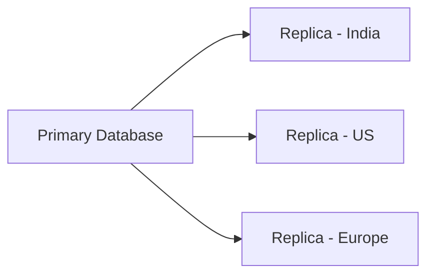
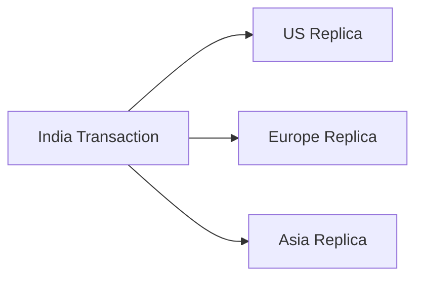

## Consistency Models: Why Distributed Systems Sometimes Show “Old Data”

You open Instagram.

You like a post.

Immediately after:

- one device shows 101 likes
- another still shows 100 likes

A few moments later:

- both become synchronized

Most users never notice this.

But behind the scenes, something important happened:

> The system temporarily allowed inconsistent data.

At first, this feels wrong.

Shouldn’t every server always show the exact same data?

In small systems:

maybe.

But at global scale:

- perfect synchronization becomes expensive
- network delays become unavoidable
- distributed coordination becomes slower

This is where consistency models become important.

---

### The Bigger Reality of Distributed Systems

Once systems run across:

- multiple servers
- multiple regions
- distributed databases

there is no longer:

- one source of truth in one machine

Instead:

multiple copies of data exist simultaneously.

Example:



Now the central challenge becomes:

> How quickly should all replicas agree with each other?

That decision defines the consistency model.

---

### Why Perfect Consistency Is Difficult

Imagine a user updates profile information.

Now the system must:

- propagate updates globally
- synchronize replicas
- handle network delays
- manage failures

At small scale:

this seems manageable.

At global scale with millions of updates per second:

it becomes extremely expensive.

Because synchronization requires:

- communication
- acknowledgments
- coordination

And coordination slows systems down.

---

### The Core Trade-off

Distributed systems constantly balance:

| Goal               | Challenge                  |
| ------------------ | -------------------------- |
| Strong consistency | Higher latency             |
| High availability  | Temporary stale data       |
| Global scale       | Synchronization complexity |

This is why consistency models exist.

They define:

> How systems behave while synchronization is happening.

---

### Strong Consistency

Strong consistency guarantees:

> Every read always returns the latest committed value.

Example:

You update your bank balance.

Immediately after:

- every ATM
- every mobile app
- every banking server

must show identical updated data.

No stale reads allowed.

---

### Why Strong Consistency Feels Natural

Humans naturally expect strong consistency.

Because in daily life:

- transactions feel immediate
- balances should be accurate
- inventory counts should not be wrong

This is why systems like:

- banking
- payments
- stock trading

heavily prioritize strong consistency.

Incorrect data here can cause serious damage.

---

### The Hidden Cost of Strong Consistency

Strong consistency sounds ideal.

But it introduces major costs.

Before responding:

systems may need:

- synchronization across replicas
- acknowledgments from multiple nodes
- distributed coordination

This increases:

- latency
- operational complexity
- failure sensitivity

At global scale:

this becomes difficult.

---

### Real-World Example: Global Banking

Suppose a transaction occurs in India.

If every global banking server must synchronize before response:



Now response speed depends on:

- network latency
- global coordination
- replica health

Strong consistency improves correctness.

But may reduce performance and availability.

---

### Eventual Consistency

Eventual consistency guarantees:

> If no new updates occur, all replicas eventually become synchronized.

Not instantly.

Eventually.

This is the consistency model powering much of the modern internet.

---

### Why Eventual Consistency Became Popular

Large-scale systems prioritize:

- scalability
- availability
- responsiveness

Users often prefer:

- slightly outdated information

instead of:

- slow systems
- downtime

This trade-off changed internet architecture significantly.

---

### Real-World Example: Social Media Likes

Suppose you like a post.

The system may:

- update nearby replica immediately
- asynchronously propagate globally

For a brief moment:

different users may see different counts.

But eventually:

all replicas converge.

---

### Why Users Usually Accept Eventual Consistency

Not all inconsistencies are equally harmful.

Example:

Temporary inconsistency is acceptable for:

- like counts
- view counts
- recommendations
- feeds
- analytics

But dangerous for:

- payments
- financial balances
- inventory transactions

This is why different systems choose different consistency models.

---

### Read-After-Write Consistency

A very common user expectation:

> “If I update something, I should immediately see my own update.”

This is called:

**Read-After-Write Consistency**

Example:

You upload a profile picture.

You expect:

- your next refresh shows the new image

even if other users still temporarily see the old one.

This improves perceived reliability for users.

---

### Monotonic Reads

Another important consistency model:

> Once a user sees newer data, they should never see older data again.

Example:

If your feed refresh shows:

- 105 likes

you should not later see:

- 102 likes

This consistency model improves user experience significantly.

---

### Causal Consistency

Some events must preserve logical order.

Example:

```text
Message 1:
"Let's meet tomorrow"

Message 2:
"At 5 PM"
```

Users should not see:

- Message 2 before Message 1

This is called causal consistency.

Very important in:

- messaging systems
- collaborative systems
- social interactions

---

### Why Replication Creates Consistency Challenges

Replication improves:

- scalability
- availability
- fault tolerance

But replication also creates:

- synchronization delays
- stale reads
- conflict resolution problems

Every distributed database must balance these trade-offs.

---

### The Physics Problem

One of the deepest realities in distributed systems:

> Data synchronization is limited by physics itself.

Even light takes time to travel.

Global consistency requires:

- communication across continents
- acknowledgments
- network coordination

At scale:

instant global synchronization becomes unrealistic.

This is why distributed systems tolerate temporary inconsistency.

---

### Real-World Example: YouTube View Counts

When a viral video receives millions of views:

updating a single globally consistent counter instantly becomes expensive.

Instead systems often:

- aggregate counts regionally
- synchronize asynchronously
- update periodically

This improves scalability dramatically.

---

### Consistency vs User Experience

An important engineering insight:

Users do not always need perfect consistency.

They need:

- predictable experience
- reasonable correctness
- responsive systems

Sometimes:

fast responses matter more than perfect synchronization.

---

### Different Parts of the Same Product Use Different Models

Large systems rarely use one consistency model everywhere.

Example:

| Component     | Likely Consistency Preference |
| ------------- | ----------------------------- |
| Payments      | Strong Consistency            |
| Feed          | Eventual Consistency          |
| Notifications | Eventual Consistency          |
| Chat Ordering | Causal Consistency            |
| User Settings | Read-After-Write              |

This is how mature systems evolve.

---

### Distributed Systems Are About Controlled Imperfection

One of the hardest mindset shifts for beginners:

> Distributed systems are not perfectly synchronized machines.

They are:

- independent systems
- communicating over unreliable networks
- constantly reconciling state

Consistency models define how much temporary imperfection is acceptable.

---

### Practical Engineering Mindset

Good engineers ask:

- What inconsistency is acceptable?
- What data must always remain correct?
- What latency trade-offs exist?
- What failures can occur?
- How will users experience stale data?

These questions shape real architectures.

---

### The Bigger Lesson

Consistency models teach one of the most important truths in distributed systems:

> Scalability often requires relaxing strict guarantees carefully.

Perfect synchronization everywhere may sound ideal.

But global-scale systems survive by:

- balancing correctness
- controlling inconsistency
- optimizing user experience
- reducing coordination overhead

---

### Final Takeaway

Consistency models are not just database behavior.

They define:

- user experience
- scalability limits
- system responsiveness
- fault tolerance
- operational complexity

Large-scale systems constantly balance:

- consistency
- performance
- availability

And different parts of the same architecture often choose differently.

Understanding these trade-offs is one of the key transitions from:

- writing applications

to:

- designing distributed systems.

---

### In the Next Blog

Now that we understand how distributed systems manage consistency at scale, the next question becomes:

👉How do large systems process massive workloads without slowing down user requests?

In the next article, we’ll explore Message Queues and Event-Driven Systems, and understand how systems like Uber, Netflix, and Amazon handle millions of asynchronous operations reliably.
