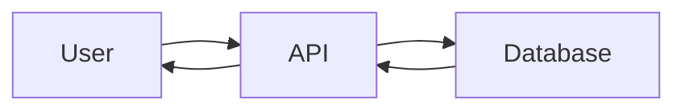
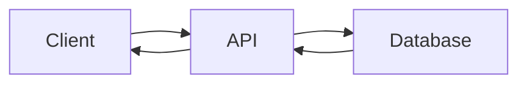
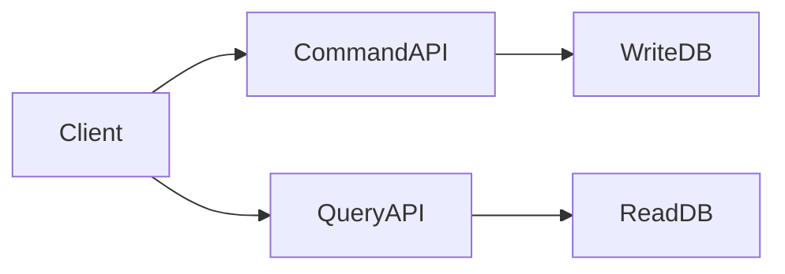
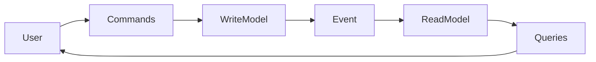

## CQRS: Why Should Reads and Writes Always Follow the Same Path?

**Previously...**

In the last few blogs, we've been gradually transforming a simple application into a distributed system.

We started with a monolith.

Then we split it into independent microservices.

Each service got its own database.

Finally, we learned how the Saga Pattern helps multiple services complete a single business operation without relying on one giant database transaction.

At this point our architecture is becoming much more scalable.

But a different problem quietly begins to appear.

One that has nothing to do with databases.

Nothing to do with networking.

And everything to do with **how we think about data.**

---

### A Story Every Growing Product Eventually Experiences

Imagine you're an engineer working on Instagram.

Yesterday your platform processed:

- 80,000 new posts
- 1 million comments
- 500,000 profile updates

Sounds like a lot.

Now look at today's numbers.

Millions of users have opened the app.

Most of them aren't creating content.

They're simply:

- scrolling their feed
- opening profiles
- watching reels
- reading comments
- searching for creators

For every write operation...

There are hundreds, sometimes thousands, of read operations.

Yet your system processes both using exactly the same architecture.

The same APIs.

The same database.

The same models.

The same scaling strategy.

At first, nobody questions it.

Then one day the system starts slowing down.

---

### The Question Nobody Asked

For decades, software has been built around a simple assumption.

> Reading and writing data are part of the same operation.

So naturally they should use:

- the same database
- the same models
- the same service
- the same API

This approach became so common that most developers never stop to question it.

But architecture often begins with questioning assumptions.

So let's ask one.

> Why should reading and writing data always follow the same path?

---

### A Supermarket Analogy

Imagine a supermarket.

Customers enter through the front door.

They:

- browse shelves
- pick products
- pay
- leave

Employees enter through another entrance.

Their job is completely different.

They:

- unload trucks
- stock shelves
- update prices
- manage inventory

Both groups interact with the same store.

But they have completely different responsibilities.

Now imagine forcing everyone to use the exact same entrance, workflow and equipment.

Customers would constantly interfere with employees.

Employees would slow down customers.

Neither side would work efficiently.

This is exactly what happens in many software systems.

Reads and writes have different goals.

Yet we often force them through the same architecture.

---

### How CRUD Became the Default

To understand CQRS, we first need to understand why almost every application starts with CRUD.

CRUD stands for:

- Create
- Read
- Update
- Delete

For decades, this model has been the foundation of software development.

A simple application usually looks like this:



Simple.

Predictable.

Easy to understand.

For thousands of applications...

CRUD is exactly the right solution.

So why change it?

---

### CRUD Was Built for a Different World

When relational databases became popular:

Most applications were:

- accounting systems
- HR software
- inventory systems
- banking portals

Traffic was relatively balanced.

If a company had:

10 employees creating records...

it probably also had:

10 employees reading records.

The workload looked similar.

Using one model for everything made perfect sense.

But today's internet products behave very differently.

---

### Modern Products Are Read-Heavy

Think about your own daily activity.

How many times do you:

- scroll Instagram?
- refresh LinkedIn?
- search on Amazon?
- watch YouTube?
- browse Netflix?

Now compare that with how often you:

- upload a post
- update your profile
- change your password
- purchase something

The difference is enormous.

A simplified example might look like this:

| Operation | Requests |
|-----------|---------:|
| Feed Views | 10,000,000 |
| Search Queries | 2,000,000 |
| Profile Updates | 25,000 |
| New Posts | 8,000 |

The workload is no longer balanced.

Reads dominate.

---

### The Hidden Bottleneck

Suppose both reads and writes use:

- the same database
- the same indexes
- the same models
- the same infrastructure

Now imagine a celebrity posts something.

Millions of users refresh their feed.

The database becomes overwhelmed serving read requests.

Suddenly...

Someone trying to update their profile experiences delays.

Why?

Because writes are competing with reads.

Completely different workloads are fighting over the same resources.

---

### Evolution of the Problem

As systems evolved...

their architecture evolved too.

```text
Single User
      │
      ▼
Small CRUD Application
      │
      ▼
Growing User Base
      │
      ▼
Millions of Reads
      │
      ▼
Reads and Writes Compete
      │
      ▼
Performance Bottlenecks
      │
      ▼
A Different Architecture Becomes Necessary
```

Notice something important.

Nobody invented CQRS because it sounded interesting.

It emerged because existing architectures started showing their limits.

Like every pattern we've studied so far...

CQRS is a response to a real engineering problem.

---

### The First Insight

Before we even define CQRS, here's the key idea I'd like you to remember.

Reading data and writing data are fundamentally different activities.

They have:

- different traffic patterns
- different performance requirements
- different scaling strategies
- different optimization techniques

Treating them as identical works...

Until it doesn't.

And that's exactly where our story continues.

---

### Stop & Think

Before we introduce CQRS, pause for a moment and think about this.

Imagine you're responsible for designing Instagram.

During the next hour:

- 15 million users will refresh their feed.
- 2 million users will open profiles.
- 500,000 users will search for creators.
- Only 30,000 users will upload a new post.

Now ask yourself:

> If reads outnumber writes by hundreds of times, does it still make sense to force both through exactly the same architecture?

Most systems do.

CQRS asks a different question.

---

### So, What Exactly Is CQRS?

CQRS stands for:

**Command Query Responsibility Segregation**

The name sounds complicated.

The idea isn't.

CQRS simply says:

> Reading data and writing data solve different problems.

So instead of building one model that tries to do both, we separate them.

One side becomes responsible for changing data.

The other becomes responsible for serving data efficiently.

Instead of this:



CQRS becomes:



Notice something important.

We're not separating databases just because we can.

We're separating responsibilities.

That's the heart of CQRS.

---

### Understanding Commands

A command is simply:

> An operation that changes the state of the system.

Examples:

- Place Order
- Upload Photo
- Update Profile
- Transfer Money
- Create Product

Notice something interesting.

Commands don't ask for information.

They ask the system to do something.

Think of commands like giving instructions.

> Create this.

> Delete that.

> Update this record.

Their job is to modify reality.

---

### Understanding Queries

Queries are the opposite.

They never change anything.

Their only purpose is to answer questions.

Examples:

- Show my profile
- Get latest posts
- Search products
- View order history
- Display notifications

Queries should never modify data.

They're simply readers.

---

### Why Keep Them Together?

This is how most applications look.

```text
UserController

Create User

Get User

Update User

Delete User
```

Everything lives together.

Initially this feels clean.

But eventually problems appear.

---

### Different Goals Require Different Optimizations

Imagine a library.

Librarians have two jobs.

Job 1:

Adding new books.

They care about:

- correct cataloguing
- validation
- classification

Job 2:

Helping visitors find books.

They care about:

- speed
- search
- recommendations

Trying to optimize both jobs with the exact same workflow would slow everyone down.

Software behaves similarly.

Writes optimize for correctness.

Reads optimize for speed.

Those are different goals.

---

### How CQRS Changes the Architecture

Instead of one model trying to satisfy both,

we create two independent models.



Now each side evolves independently.

---

**Wait...**

Did You Notice Something?

The Read Model isn't updated directly.

Instead,

changes flow through **events**.

Why?

Because writes happen first.

Reads are updated afterwards.

This is where another important distributed systems concept appears:

**Eventual Consistency**

---

### Eventual Consistency Returns

Remember our previous blog?

We discussed why distributed systems sometimes show slightly old information.

CQRS embraces that idea.

Imagine uploading a new YouTube video.

Immediately after uploading,

the video exists.

But:

- recommendations may take a few seconds.
- search results may take a little longer.
- trending pages update later.

Everything eventually catches up.

That delay is often acceptable.

Because it allows the system to scale much better.

---

### Production Reality

One mistake many engineers make is assuming CQRS always means:

Two databases.

Not necessarily.

CQRS is primarily about separating models.

Some systems use:

- one physical database
- two logical models

Others use:

- separate databases
- separate storage technologies

Example:

```text
Write Model

PostgreSQL

↓

Event

↓

Read Model

Redis

↓

ElasticSearch
```

Each storage system is chosen for what it does best.

---

### Why Big Companies Love This

Imagine Amazon.

Writing a product:

- validation
- pricing
- inventory
- seller verification

Reading a product:

- search
- recommendations
- filters
- reviews

Those are completely different workloads.

CQRS allows each side to evolve independently.

The write side protects business rules.

The read side focuses on user experience.

---

### But CQRS Isn't Free

Like every architecture pattern,

CQRS solves problems.

And introduces new ones.

---

**Challenge 1**

More Infrastructure

Instead of managing:

one model

you now manage:

two.

That means:

- more code
- more deployments
- more monitoring

Complexity increases.

---

**Challenge 2**

Synchronization

The read model depends on events.

If events fail,

the read model may become outdated.

Now engineers must think about:

- retries
- event delivery
- ordering
- replay

Suddenly architecture becomes much more interesting.

---

**Challenge 3**

Debugging

Earlier:

everything happened inside one request.

Now:

Request

↓

Write Model

↓

Message Broker

↓

Read Model

↓

Cache

↓

User

Finding problems becomes harder.

Observability becomes essential.

We'll cover that later in the series.

---

### Common Mistakes

One of the biggest mistakes is assuming CQRS makes every system better.

It doesn't.

For example,

a simple Notes application probably doesn't need:

- multiple models
- event streams
- asynchronous updates

CRUD is simpler.

And simplicity is a feature.

Another common mistake:

Separating reads and writes before there's an actual scaling problem.

Remember:

Architecture should solve today's problems.

Not tomorrow's guesses.

---

### When Should You Use CQRS?

CQRS shines when:

- reads heavily outnumber writes
- read queries become complex
- writes involve strict business rules
- different scaling strategies are required
- reporting workloads affect transactional workloads

Good examples:

- social media feeds
- e-commerce platforms
- financial systems
- recommendation engines
- analytics dashboards

---

### When Should You Avoid It?

Don't use CQRS just because it's popular.

Avoid it when:

- the application is small
- CRUD already works well
- the team is inexperienced with distributed systems
- operational simplicity matters more than scalability

Sometimes,

the simplest architecture is still the best one.

---

### Interview Perspective

A common interview question is:

> Why can't we simply optimize the database instead of using CQRS?

Because the problem often isn't database performance.

The problem is that reads and writes have fundamentally different characteristics.

Scaling one together with the other becomes inefficient.

Another common question:

> Does CQRS require Event Sourcing?

No.

CQRS and Event Sourcing complement each other,

but neither requires the other.

We'll explore Event Sourcing in the next blog.

---

### Engineering Mindset

A junior engineer asks:

> "How can I make my database faster?"

A senior engineer asks:

> "Why are reads and writes sharing the same architecture in the first place?"

That question changes everything.

CQRS isn't about adding more databases.

It isn't about adding more services.

It's about recognizing that different problems deserve different solutions.

---

### Final Takeaway

CQRS is one of the first patterns that teaches us to stop thinking in terms of technology and start thinking in terms of **workloads**.

The question isn't:

> SQL or NoSQL?

The question isn't:

> PostgreSQL or MongoDB?

The real question is:

> Are we forcing two completely different problems through the same architecture?

Sometimes the answer is yes.

And that's when CQRS becomes valuable.

Like every pattern we've explored so far,

CQRS wasn't invented because engineers wanted more complexity.

It emerged because existing architectures eventually reached their limits.

Understanding **why** it emerged is far more valuable than memorizing its definition.

---

### What's Next?

So far we've learned:

```text
Monolith
      │
      ▼
Microservices
      │
      ▼
Database Per Service
      │
      ▼
Saga Pattern
      │
      ▼
CQRS
```

Notice something interesting.

The Read Model in CQRS doesn't update itself.

Something has to tell it **what changed**.

That "something" is usually an event.

But what exactly is an event?

Should we simply store the latest state?

Or should we store every change that ever happened?

That question led to another revolutionary architectural pattern.

In the next blog, we'll explore **Event Sourcing**, one of the most powerful-and most misunderstood-patterns in distributed systems.
