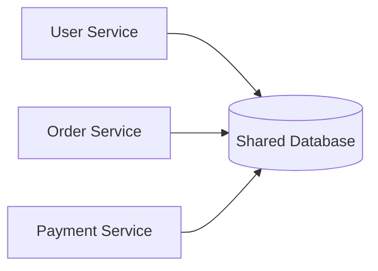
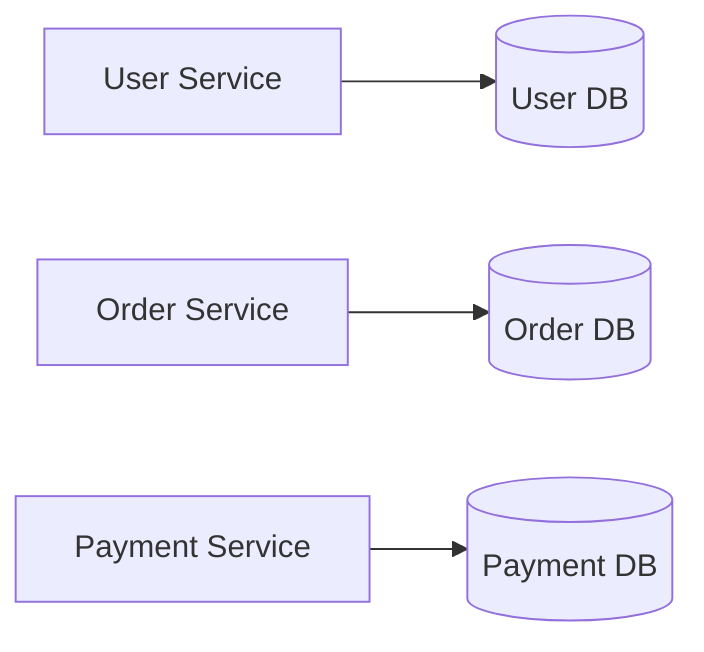
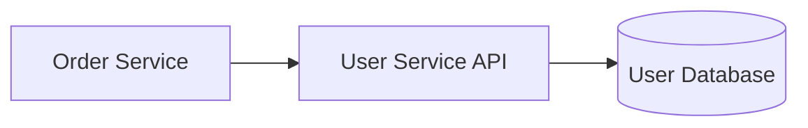

## Database Per Service Pattern: Why Sharing a Database Eventually Breaks Microservices

When teams first adopt microservices, they usually split the application into separate services.

For example:

- User Service
- Product Service
- Order Service
- Payment Service

Everything looks modular.

Each service has its own codebase.

Its own deployment pipeline.

Its own team.

Then someone asks:

> "Do we really need multiple databases? Why don't all services just use the same one?"

It sounds like a reasonable idea.

In fact, many teams do exactly that.

Initially, everything works.

Months later, it becomes one of the biggest architectural bottlenecks.

---

### The Illusion of Independence

Consider this architecture.



At first glance, this seems efficient.

- one database
- one backup strategy
- one connection pool
- one source of truth

So what's the problem?

The services are independent.

The database isn't.

---

### The Real Problem Isn't the Database

The database itself isn't bad.

The problem is:

> Multiple services now depend on the same data model.

This creates coupling.

And coupling spreads much faster than most teams expect.

---

### Real-World Analogy

Imagine three different companies renting offices inside one building.

Initially they share:

- electricity
- meeting rooms
- storage
- reception

Everything feels convenient.

Then one company decides to renovate.

Suddenly:

- everyone is affected
- schedules change
- operations slow down

Shared infrastructure creates shared dependencies.

The same thing happens with databases.

---

**Problem 1: Schema Changes Become Dangerous**

Suppose the Order Service changes a table.

```sql
Orders
```

A new column is added.

A column is renamed.

An index is removed.

Unexpectedly:

Payment Service starts failing.

Not because its code changed.

Because its dependency changed.

Now every database migration becomes a cross-team discussion.

---

**Problem 2: Teams Lose Autonomy**

Microservices aim to enable independent teams.

But if every team depends on the same database:

every schema change requires coordination.

Now deployments become slower.

The architecture no longer supports team independence.

---

**Problem 3: Hidden Coupling**

Sometimes services don't even use APIs anymore.

Instead they query each other's tables directly.

Example:

```text
Order Service

SELECT * FROM Users
```

Seems harmless.

Until User Service redesigns its schema.

Now another service breaks without warning.

The services appear independent.

Underneath, they're tightly connected.

---

**Problem 4: Scaling Becomes Difficult**

Suppose:

Product Service experiences massive traffic.

Ideally:

only Product Service should scale.

But if every service shares one database:

that database becomes the bottleneck.

Adding more application instances won't solve database contention.

---

### How This Pattern Emerged

As companies like Amazon and Netflix grew, they discovered something interesting.

Breaking applications into services wasn't enough.

The data also needed boundaries.

Otherwise:

the database became the new monolith.

This led to the Database Per Service pattern.

---

### Database Per Service

Instead of sharing one database:

every service owns its own data.



Now every service owns:

- schema
- migrations
- indexes
- optimization
- backups

No other service can modify its database directly.

---

### What Does "Ownership" Really Mean?

Ownership means:

Other services never query your database.

If they need information:

they call your API.

This keeps responsibilities clear.

Example:

Instead of:

```text
Order Service → User Database
```

Use:



The database becomes an implementation detail.

Not a shared contract.

---

### But Doesn't This Duplicate Data?

Yes.

And that's completely normal.

Many newcomers think:

> "Duplicating data is bad."

In distributed systems:

controlled duplication is often better than tight coupling.

For example:

Order Service may store:

- User ID
- User Name
- Shipping Address

Even though User Service also stores this information.

Because Order Service owns the order.

It should remain valid even if the user's profile changes later.

---

### New Challenges Appear

Like every architectural decision:

Database Per Service solves problems.

But creates new ones.

---

**Challenge 1: Distributed Queries**

Earlier:

everything was in one database.

Now information is spread across services.

Generating reports becomes harder.

---

**Challenge 2: Distributed Transactions**

Suppose placing an order requires:

- Order Service
- Payment Service
- Inventory Service

Each owns its own database.

How do you guarantee all succeed together?

Traditional database transactions no longer work.

This challenge eventually led to patterns like:

- Saga Pattern
- Event-Driven Architecture

We'll cover these later in the series.

---

**Challenge 3: Data Consistency**

Since services own different databases:

updates are no longer immediate everywhere.

Systems often rely on:

- events
- asynchronous communication
- eventual consistency

This is another trade-off of distributed systems.

---

### Why APIs Become More Important

Once every service owns its data:

communication shifts from:

Database calls

to

API calls.

This improves:

- encapsulation
- maintainability
- scalability

Services expose capabilities.

Not tables.

---

### The Bigger Lesson

Database Per Service isn't really about databases.

It's about ownership.

Every mature architecture eventually learns:

> Teams scale better when responsibilities have clear boundaries.

The same principle applies to data.

---

### Practical Engineering Mindset

Ask yourself:

- Who owns this data?
- Can another team change my schema?
- Am I querying another service's database?
- Could this service evolve independently?

If the answer is no,

there's probably hidden coupling in the architecture.

---

### Final Takeaway

Breaking an application into microservices is only half the journey.

If every service still depends on the same database,

the architecture remains tightly coupled.

Database Per Service encourages:

- clear ownership
- independent evolution
- autonomous teams
- scalable systems

But it also introduces new distributed systems challenges.

As you'll discover throughout this series,

every architectural improvement solves one problem while introducing another.

That's the essence of system design.

---

### In the Next Blog

Now that each service owns its own data, a new question arises:

> What happens when one service succeeds but another fails?

In the next article, we'll explore the **Saga Pattern**, one of the most important approaches for managing distributed transactions across multiple services.