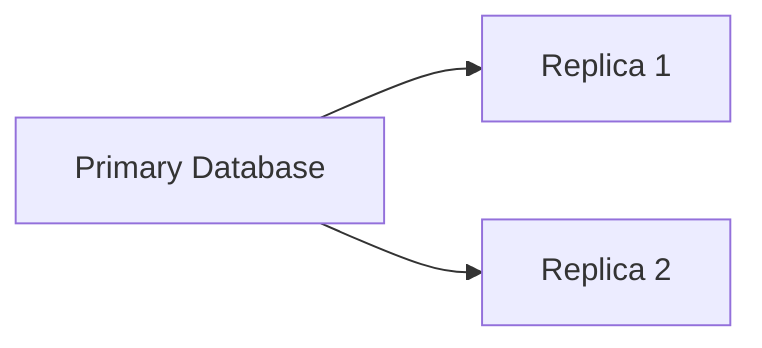
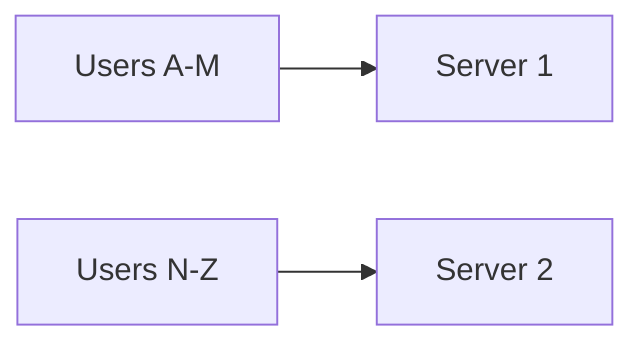

## Databases in System Design: Why One Database Is Never Enough

Every large-scale application eventually reaches a point where the database becomes the center of everything.

At first, databases feel simple.

You:

- store data
- query data
- update data

And everything works.

But as systems grow:

- traffic increases
- relationships become complex
- writes become frequent
- reads explode
- latency expectations become stricter

Suddenly:

> The database is no longer “just storage.”

It becomes:

- the bottleneck
- the scaling challenge
- the consistency problem
- the reliability concern

Understanding databases deeply is one of the most important parts of system design.

---

### The Misconception Beginners Usually Have

A very common beginner assumption is:

> “We just need a database.”

But experienced engineers think differently.

They ask:

- What type of workload exists?
- Is the system read-heavy or write-heavy?
- Do we prioritize consistency or availability?
- Will data relationships become complex?
- How will this scale under millions of users?

Because different systems have different needs.

And that changes everything.

---

### Real-World Analogy: Library vs Warehouse

Imagine two systems.

---

**System 1: A Library**

A library needs:

- structured organization
- relationships between books
- accurate records
- precise search capability

This is similar to relational databases.

---

**System 2: A Massive Warehouse**

A warehouse prioritizes:

- speed
- scalability
- rapid storage
- flexible organization

This is similar to many NoSQL systems.

Neither is universally “better.”

They solve different problems.

That is the key mindset.

---

### The Core Purpose of a Database

A database exists to solve four major problems:

- persistent storage
- efficient retrieval
- concurrent access
- data consistency

But once scale enters the picture:

trade-offs become unavoidable.

---

### SQL Databases: Structure and Reliability

SQL databases are relational databases.

Examples:

- PostgreSQL
- MySQL
- MariaDB

They organize data into:

- tables
- rows
- columns
- relationships

Example:

```sql
Users
Posts
Comments
Orders
Payments
```

Relationships are extremely important here.

---

### Why SQL Became Dominant

SQL databases became popular because businesses needed:
- accurate transactions
- structured relationships
- reliable consistency

Example:

Banking systems cannot tolerate:
- missing transactions
- inconsistent balances
- duplicate payments

SQL databases are designed for this reliability.

---

### ACID Properties: The Foundation of Reliability

Relational databases heavily focus on ACID guarantees.

---

**Atomicity**

Either everything succeeds or nothing succeeds.

Example:

Money transfer:

```text
Debit Account A
Credit Account B
```

Both operations must succeed together.

---

**Consistency**

The database always remains valid.

Rules and constraints are preserved.

---

**Isolation**

Multiple users can interact simultaneously without corrupting data.

---

**Durability**

Once data is committed:

👉 it survives crashes.

---

### Why SQL Databases Are Powerful

SQL databases excel at:
- complex queries
- relationships
- joins
- transactions
- consistency

This makes them ideal for:
- banking systems
- payment systems
- ERP software
- inventory management

---

### The Scaling Problem with SQL Systems

As traffic grows:

new challenges appear.

Example:
- millions of writes
- massive concurrent users
- global scale

Now relational systems may struggle because:
- joins become expensive
- vertical scaling has limits
- distributed consistency is hard

This is where NoSQL systems emerged.

---

### NoSQL Databases: Scalability First

NoSQL does not mean:

> “No SQL exists.”

It generally means:

> “Not only SQL.”

These systems prioritize:
- horizontal scaling
- flexibility
- distributed architecture
- high throughput

Examples:
- MongoDB
- Cassandra
- DynamoDB
- Redis

---

### Why NoSQL Systems Became Necessary

Companies like:
- Google
- Amazon
- Facebook

faced enormous scale problems.

Traditional relational systems became difficult to scale globally.

Example:

Instagram stores:
- likes
- comments
- feeds
- stories
- activity logs

At enormous volume.

Some workloads benefit more from distributed NoSQL systems.

---

### Different Types of NoSQL Databases

NoSQL itself is not one category.

There are multiple models.

---

**1\. Document Databases**

Example:

- MongoDB

Data stored as flexible documents.

Example:

```json
{
  "user": "Nikhil",
  "followers": 1200
}
```

Good for:
- flexible schemas
- rapidly evolving applications

---

**2. Key-Value Stores**

Example:
- Redis
- DynamoDB

Data stored as:


Extremely fast.

Used heavily for:
- caching
- sessions
- real-time systems

---

**3. Wide Column Databases**

Example:
- Cassandra

Designed for:
- massive distributed writes
- high scalability

Used in systems requiring enormous throughput.

---

**4. Graph Databases**

Example:
- Neo4j

Optimized for relationships.

Useful for:
- social networks
- recommendation systems
- fraud detection

---

### SQL vs NoSQL Is Not a War

One of the biggest misconceptions online:

> SQL vs NoSQL

In reality:

large companies use BOTH.

Because different workloads need different storage models.

This is called:

**Polyglot Persistence**

Meaning:

> Use the right database for the right problem.

---

### Real-World Example: Amazon

Amazon may use:
- relational DBs for payments
- NoSQL for product catalog
- Redis for caching
- search engines for search queries

Because every workload behaves differently.

This is how real systems evolve.

---

### Read Scaling vs Write Scaling

Another major challenge in databases:

different systems struggle differently.

---

### Read-Heavy Systems

Example:
- YouTube
- Instagram
- News websites

Millions of users reading content repeatedly.

Solution approaches:
- caching
- read replicas
- CDNs

---

### Write-Heavy Systems

Example:
- logging systems
- analytics pipelines
- IoT systems

Massive continuous writes.

Now systems optimize for:
- write throughput
- partitioning
- distributed ingestion

---

### Replication: Making Databases More Available

One database server is dangerous.

If it crashes:

the system may fail entirely.

So systems introduce replication.



Now:
- reads can scale
- availability improves
- backups become easier

But replication introduces another challenge:

**Consistency Delays**

Replicas may lag slightly behind.

Now users may temporarily see old data.

This is one of the central trade-offs in distributed systems.

---

### Partitioning and Sharding

Eventually even one database cluster becomes insufficient.

Now data itself must be split.

This is called:
- partitioning
- sharding

Example:



This distributes load across machines.

But introduces huge complexity:
- rebalancing
- hotspot handling
- distributed queries
- cross-shard transactions

Scaling databases is one of the hardest engineering problems.

---

### Why Database Design Shapes Entire Architecture

Databases influence:
- APIs
- caching strategies
- scaling models
- consistency guarantees
- latency
- fault tolerance

Many architectural decisions originate from database constraints.

This is why experienced engineers spend enormous time thinking about data models.

---

### Eventual Consistency: The Internet Runs on It

At global scale:

strong consistency everywhere becomes expensive.

So many systems accept:
- temporary inconsistency

Example:

You like a post.

Another device sees the updated like count slightly later.

This is acceptable because:
- scalability improves dramatically
- systems remain highly available

Large systems constantly balance:
- consistency
- performance
- availability

---

### The Bigger Lesson

Databases are not just storage engines.

They are:
- performance systems
- consistency systems
- distributed systems
- reliability systems

Choosing the wrong database architecture can limit the entire product.

---

### Practical Engineering Mindset

Instead of asking:

> “Which database is best?”

Ask:
- What problem am I solving?
- What type of workload exists?
- What are the scaling expectations?
- What consistency guarantees are required?
- What failure scenarios can occur?

This is how real-world engineering decisions happen.

---

### Final Takeaway

There is no perfect database.

Every database optimizes for something:
- consistency
- scalability
- speed
- flexibility
- availability

Large-scale systems succeed because they understand these trade-offs deeply.

And over time, most mature systems evolve toward:
- multiple databases
- specialized storage layers
- distributed data architecture

Because at scale:

> One storage solution is rarely enough for every workload.

---

### In the Next Blog

Now that we understand how large systems store and scale data, the next question becomes:

👉 What happens when distributed systems cannot guarantee everything at once?

In the next article, we’ll explore the CAP Theorem, and understand why distributed systems must constantly balance consistency, availability, and partition tolerance.
