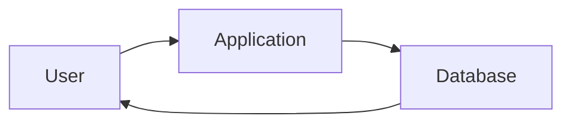
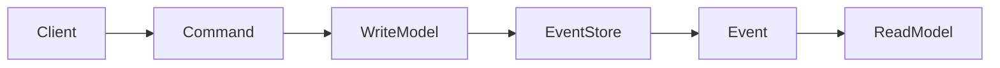
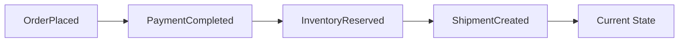
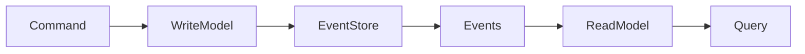
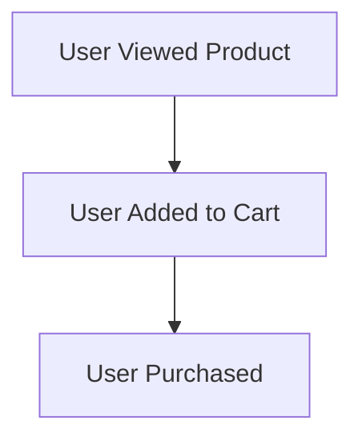
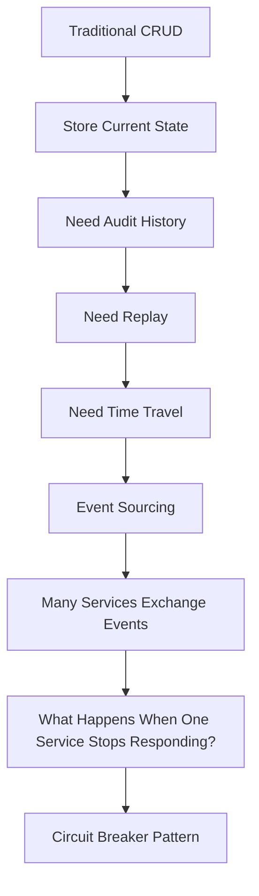

## Event Sourcing: What If We Never Lost the History?

**Previously...**

Our journey into distributed systems has been building one concept at a time.

We started with monolithic applications and gradually broke them into independent microservices.

Then we learned why every service should own its own database instead of sharing one.

As services became independent, we discovered that a single business operation could now span multiple databases, leading us to the **Saga Pattern**, where consistency is maintained through compensating actions instead of traditional database transactions.

Finally, in the previous blog, we explored **CQRS** and realized that reading data and writing data are fundamentally different problems. Instead of forcing both through the same architecture, CQRS separates them into independent models that can evolve and scale differently.

At this point, our architecture has become significantly more scalable.

But it also introduces a new question.

When the write model changes the state of the system...

**What exactly should it store?**

Most applications have answered this question the same way for decades.

Store the latest state.

But what if that isn't enough?

---

### A Question That Sounds Surprisingly Simple

Imagine opening your banking app.

You see:

```text
Current Balance

₹42,350
```

Everything looks normal.

Out of curiosity, you ask the bank:

> "How did my balance become ₹42,350?"

The system responds:

> "We don't know."

Sounds ridiculous.

A bank that cannot explain how your balance was calculated would immediately lose your trust.

You'd naturally ask:

- When was money deposited?
- When was it withdrawn?
- Who made the transaction?
- Was there a refund?
- Was interest added?

You don't just care about **where you are today**.

You care about **how you got here.**

Now think about this.

Many software systems behave exactly like that imaginary bank.

They know the current state.

But they no longer remember the journey.

---

### The Hidden Assumption Most Applications Make

Open almost any database table.

You might see something like this:

| Account ID | Balance |
| ---------- | ------- |
| 101        | ₹42,350 |

Looks perfectly reasonable.

But notice what's missing.

There is no record of:

- deposits
- withdrawals
- refunds
- transfers

Every time something changes...

the previous value disappears.

The old state is overwritten.

In other words:

```text
Balance

₹40,000

↓

Deposit ₹5,000

↓

Balance

₹45,000

↓

Withdraw ₹2,650

↓

Balance

₹42,350
```

The database only remembers:

```text
₹42,350
```

Everything else is gone.

---

### State Is Like the Last Page of a Book

Imagine someone hands you the final page of a mystery novel.

You immediately know:

- who survived
- who solved the mystery
- how the story ended

But you've completely lost:

- the suspense
- the twists
- the journey

Current state works the same way.

It tells you:

> "This is where we are."

It cannot answer:

> "How did we get here?"

For many applications...

that's perfectly fine.

But not for all of them.

---

### When Current State Stops Being Enough

Let's leave banking for a moment.

Imagine you're building an e-commerce platform.

A customer places an order.

Initially:

```text
Order Status

Pending
```

A few minutes later:

```text
Order Status

Paid
```

Then:

```text
Order Status

Packed
```

Then:

```text
Order Status

Shipped
```

Finally:

```text
Order Status

Delivered
```

If your database only stores:

```text
Delivered
```

Can you answer questions like:

- When was payment completed?
- How long did packing take?
- Which warehouse shipped the order?
- Was it delayed?
- Did the customer request cancellation before shipping?

Not anymore.

The history disappeared.

---

### The World Before Distributed Systems

For decades, this wasn't considered a major problem.

Applications were relatively simple.

Most business questions could be answered using:

- current state
- audit tables
- application logs

Architecture looked like this:



One application.

One database.

One source of truth.

For many businesses...

this still works beautifully.

So why did engineers begin looking for something different?

---

### How This Problem Emerged

As systems became larger, something changed.

Applications were no longer just storing information.

They were becoming platforms.

Think about companies like:

- Amazon
- Netflix
- Uber
- Stripe

Every action inside these platforms matters.

Not just the current state.

The journey itself.

Questions started becoming more sophisticated.

Instead of asking:

> "What's the customer's balance?"

Teams started asking:

- How did the balance change?
- What happened yesterday?
- Can we rebuild last week's reports?
- Can we investigate fraud?
- Can we replay failed workflows?

These questions are impossible to answer if history has already been discarded.

The problem wasn't the database.

The problem was the way we thought about data.

---

### A Different Way to Think About Data

Most applications think like this:

```text
Current State

↓

Update Current State

↓

Replace Old Value
```

Event-driven systems ask a different question.

Instead of asking:

> "What does the data look like now?"

They ask:

> "What happened to make it look this way?"

That shift sounds small.

It completely changes the architecture.

---

### Stop & Think

Imagine tomorrow every record in your production database disappeared.

Fortunately, you still have:

- every payment
- every login
- every order
- every refund
- every shipment

recorded in chronological order.

Would you be able to rebuild your entire system?

Take a moment to think about it before reading further.

Because that's exactly the question Event Sourcing answers.

---

### A Real-World Analogy: Your Bank Passbook

Before mobile banking became common, banks issued passbooks.

Every transaction was recorded.

```text
Opening Balance

₹10,000

↓

Salary Credited

+₹50,000

↓

ATM Withdrawal

-₹5,000

↓

Online Purchase

-₹2,650

↓

Interest

+₹120
```

Notice something interesting.

The bank never needed to ask:

> "What is your balance?"

It could calculate the balance by reading every transaction.

The balance wasn't the primary data.

The transactions were.

That idea sits at the heart of Event Sourcing.

---

### Another Analogy: Git

If you've used Git, you've already experienced a similar idea.

Git doesn't simply store:

> "The latest version of your project."

Instead, it stores:

- commits
- changes
- history

That's why Git allows you to:

- inspect previous versions
- understand who changed what
- revert mistakes
- rebuild any version of your project

Git treats changes as first-class citizens.

Event Sourcing applies the same philosophy to business data.

---

### Events Become More Important Than State

Instead of storing:

```text
Account Balance = ₹42,350
```

Imagine storing:

```text
Account Opened

↓

Salary Deposited

↓

ATM Withdrawal

↓

Online Purchase

↓

Interest Applied
```

Now the balance becomes something you can **derive**.

It is no longer the primary source of truth.

The events are.

This is one of the biggest mindset shifts in modern software architecture.

---

### Architecture Evolution

Let's pause and see how we've arrived here.

```text
Traditional CRUD
        │
        ▼
Current State Storage
        │
        ▼
Need Audit History
        │
        ▼
Need Replay
        │
        ▼
Need Complete Business History
        │
        ▼
A New Way of Thinking About Data
        │
        ▼
Event Sourcing
```

Notice something important.

Nobody woke up one morning and decided:

> "Let's invent Event Sourcing."

It emerged naturally because existing architectures stopped answering increasingly important business questions.

Like every pattern we've explored so far...

Event Sourcing is a response to a real problem.

Not a trendy architectural choice.

---

### Where We Go Next

So far, we've only challenged one assumption:

> Maybe storing the latest state isn't enough.

But that raises a much bigger question.

If the current state is no longer the source of truth...

**What is?**

How do we store events?

How do we rebuild state?

How do systems replay years of history?

And why do companies like Stripe, banking platforms, and accounting systems rely so heavily on this idea?

---

### So, What Is Event Sourcing?

After everything we've discussed, you can probably guess the core idea.

Instead of storing:

> **the latest state**

Event Sourcing stores:

> **every business event that changed the state.**

That's it.

That's the entire idea.

But don't let its simplicity fool you.

It changes how you think about software.

Instead of asking:

> "What's the customer's balance?"

The system asks:

> "What events happened to this account?"

The current balance is no longer stored as the primary source of truth.

It is **calculated** from those events.

---

### State vs Events

Let's compare the two approaches.

**Traditional CRUD**

```text
Account

ID: 101
Balance: ₹42,350
```

Simple.

Fast.

Easy.

But the history is gone.

---

**Event Sourcing**

```text
Account Opened

↓

Salary Credited ₹50,000

↓

ATM Withdrawal ₹5,000

↓

Online Purchase ₹2,650

↓

Interest Added ₹120
```

Nothing is overwritten.

Nothing is deleted.

Every business event becomes permanent.

The current balance simply becomes:

```text
₹10,000
+ ₹50,000
- ₹5,000
- ₹2,650
+ ₹120
----------------
₹52,470
```

The state is **derived** from the history.

---

### What Exactly Is an Event?

An event is **not**:

- a database row
- an API request
- a function call

An event represents something that has **already happened**.

Notice the wording.

Good event names are always written in the past tense.

Examples:

Good:

```text
OrderPlaced

PaymentCompleted

InventoryReserved

UserRegistered

EmailSent
```

Bad:

```text
PlaceOrder

ReserveInventory

CreateUser
```

Those are commands.

Commands ask the system to do something.

Events tell us something **already happened.**

This distinction is extremely important.

---

### Commands Become Events

Think back to CQRS.

Commands change the system.

Events describe what changed.

A simple flow looks like this:



Notice something.

The database no longer stores only the latest state.

It stores the complete history.

---

### Introducing the Event Store

Instead of a traditional database table like this:

```text
Orders

OrderID

Status
```

We now have something different.

```text
Event Store

Event ID

Aggregate ID

Event Type

Timestamp

Payload
```

Example:

| Event             | Aggregate | Time  |
| ----------------- | --------- | ----- |
| OrderPlaced       | 101       | 10:01 |
| PaymentCompleted  | 101       | 10:02 |
| InventoryReserved | 101       | 10:02 |
| ShipmentCreated   | 101       | 10:08 |

Notice what's missing.

There is no "Current Status."

The status is reconstructed by replaying events.

---

### Rebuilding State

Imagine the Order Service starts.

How does it know the order status?

Simple.

It reads every event.



After replaying those events,

the service concludes:

> Order Status = Shipped

The state wasn't stored.

It was rebuilt.

---

### Stop & Think

Imagine deleting every row from your Users table.

Scary.

Now imagine you still have every event:

- User Registered
- Email Changed
- Password Updated
- Phone Verified

Could you rebuild every user?

Yes.

That's one of the superpowers of Event Sourcing.

---

### But Doesn't Replay Become Slow?

Excellent question.

Imagine a bank account that's been active for 15 years.

It might have:

- 4 million transactions

Replaying millions of events every time someone logs in would be inefficient.

This is where snapshots come in.

---

### Snapshots

A snapshot is exactly what it sounds like.

Instead of replaying:

4 million events,

the system occasionally saves the current state.

Example:

```text
Snapshot

Balance

₹41,000

↓

Replay Remaining Events

↓

₹42,350
```

Now only recent events need to be replayed.

Snapshots dramatically improve performance.

---

### CQRS and Event Sourcing

By now you might notice something interesting.

CQRS and Event Sourcing work beautifully together.

The Write Model produces events.

Those events update Read Models.



Notice how naturally they fit together.

CQRS separates reads from writes.

Event Sourcing records every write permanently.

Together they create highly scalable architectures.

But remember:

Neither pattern requires the other.

Many systems use CQRS without Event Sourcing.

Many use Event Sourcing without CQRS.

---

### Event Replay

One of the biggest advantages of Event Sourcing is replay.

Suppose your recommendation algorithm improves.

Instead of asking users to perform actions again,

you simply replay historical events.



Your new recommendation engine can rebuild everything using the improved logic.

No data has been lost.

---

### Time Travel

Traditional databases answer:

"What does the system look like now?"

Event Sourcing answers:

"What did the system look like last Tuesday at 3:15 PM?"

Because every event is timestamped,

you can reconstruct history at any point.

This capability is incredibly valuable for:

- finance
- auditing
- compliance
- debugging

---

### Production Reality

If you've ever worked with:

- banking software
- accounting systems
- payment gateways
- trading platforms

you've probably seen Event Sourcing in some form.

These systems care deeply about history.

Deleting history would be unacceptable.

For social media or small CRUD applications,

the trade-offs often aren't worth it.

Architecture is always contextual.

---

### Common Mistakes

One of the biggest misconceptions is:

> Event Sourcing replaces your database.

It doesn't.

The Event Store **is** your source of truth.

Read models, caches, and projections are derived from it.

---

Another mistake:

Thinking Event Sourcing is an audit log.

An audit log is usually added **after** business logic.

Event Sourcing records business events **as the primary source of truth.**

History isn't an extra feature.

History **is the system.**

---

### When NOT to Use Event Sourcing

Despite its power,

Event Sourcing isn't appropriate everywhere.

Avoid it when:

- your application is simple
- history has little business value
- rebuilding state adds unnecessary complexity
- your team lacks operational experience

Examples:

- portfolio websites
- simple blogs
- basic CRUD dashboards
- small internal tools

Sometimes storing current state is exactly the right decision.

---

### Interview Perspective

A common interview question is:

> Why not simply enable database auditing?

Because auditing records changes **after** state changes occur.

Event Sourcing treats events themselves as the business truth.

Another common question:

> Can Event Sourcing delete data?

Usually,

events are considered immutable.

Instead of deleting,

new events describe what happened.

Example:

```text
OrderCancelled
```

instead of deleting:

```text
OrderPlaced
```

History remains intact.

---

### Engineering Mindset

A junior engineer thinks:

> "State is my data."

A senior engineer begins asking:

> "Is state simply the result of everything that happened before?"

That one question completely changes how you design systems.

Event Sourcing isn't really about events.

It's about changing what you consider to be the source of truth.

---

### Final Takeaway

Event Sourcing teaches one of the deepest lessons in software architecture.

Most applications ask:

> "What does the system look like right now?"

Event Sourcing asks:

> "What happened to make the system look like this?"

That single shift unlocks:

- complete audit history
- event replay
- time travel
- easier debugging
- better traceability
- resilient event-driven systems

But it also introduces:

- more infrastructure
- more operational complexity
- steeper learning curves

Like every architectural pattern in this series,

Event Sourcing is neither good nor bad.

It is simply the right tool for a specific class of problems.

The best architects don't collect patterns.

They understand **why those patterns exist.**

---

### Architecture Evolution



---

## In the Next Blog

So far, we've assumed that every service responds successfully.

But production systems don't work that way.

Services slow down.

Networks fail.

Dependencies become unavailable.

If one failing service isn't handled correctly, it can bring down an entire distributed system.

In the next article, we'll explore the **Circuit Breaker Pattern**, one of the most important resilience patterns in modern software architecture. We'll learn why continuously retrying a failing service often makes things worse—and how systems protect themselves from cascading failures.
