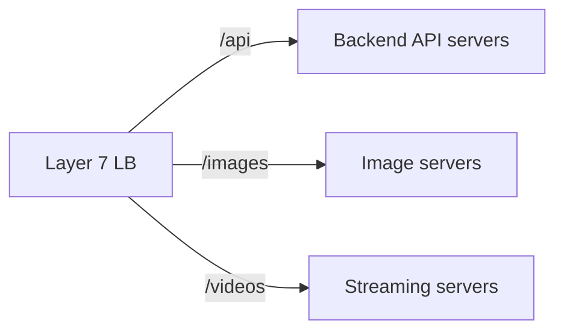
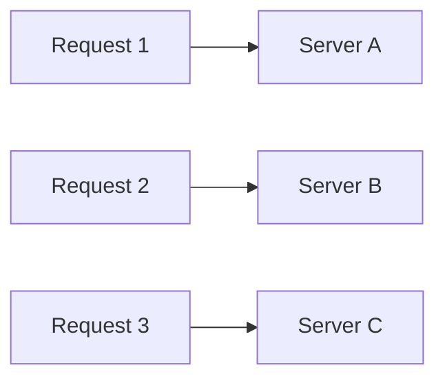
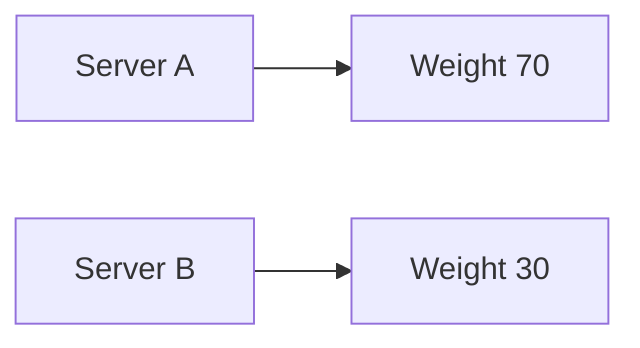
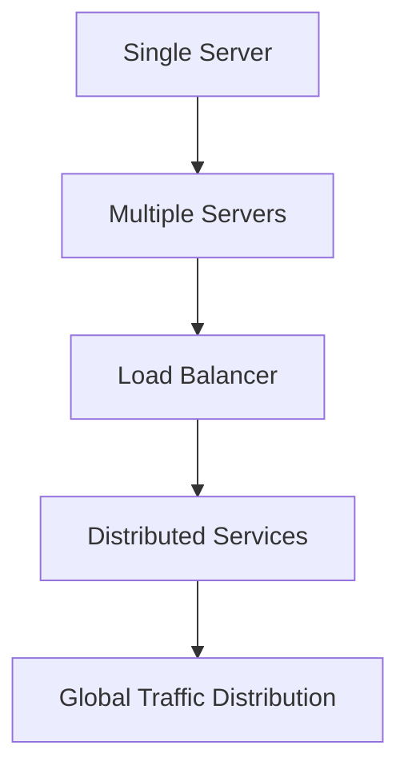

## Load Balancing: How Large Systems Survive Massive Traffic

Imagine launching your application publicly.

At first:

- 50 users visit  
- then 500  
- then 50,000  

Everything seems exciting…

Until your server starts slowing down.

Soon:

- requests begin timing out  
- users see errors  
- APIs stop responding  

Not because your code suddenly became bad.

But because:

> One machine can only handle a limited amount of work.

This is where one of the most important concepts in distributed systems appears:

# Load Balancing

Without load balancing:

- large-scale systems cannot survive
- high availability becomes impossible
- horizontal scaling becomes useless

---

## The Core Problem: A Single Server Is Fragile

A single server has limits:

- CPU
- memory
- network bandwidth
- disk I/O
- concurrent connections

No matter how powerful the machine is:

👉 eventually it becomes overloaded.

And when that happens:

- latency increases
- throughput drops
- requests fail

---

### Real-World Analogy: Restaurant Reception

Imagine a restaurant with:

- one receptionist
- one kitchen
- one chef

Initially:

- customers are handled smoothly

But suddenly:

- 500 customers arrive

Now what happens?

- customers wait in long queues
- orders get delayed
- staff becomes overwhelmed

The problem is not necessarily the chef.

The real problem is:

> Traffic is not being distributed efficiently.

Now imagine:

- multiple chefs
- multiple counters
- customers distributed intelligently

That is load balancing.

---

## What Is Load Balancing?

Load balancing means:

> Distributing incoming traffic across multiple servers so no single machine becomes overloaded.

Instead of:

You now have:

The load balancer acts like:
- a traffic controller
- a smart router
- a decision-making layer

Its job is simple:

👉 decide which server should handle each request.

---

### Why Load Balancing Matters So Much

Most people think load balancing is only about scaling.
But in reality, it solves multiple critical problems.

---

1\. Prevents Server Overload

Without load balancing:
- one server gets overwhelmed
- requests queue up
- latency increases rapidly

With load balancing:
- traffic spreads across machines
- workload becomes manageable

---

2\. Enables Horizontal Scaling

Horizontal scaling means:

👉 adding more servers instead of upgrading one machine.

But additional servers are useless unless traffic can be distributed to them.
Load balancing makes horizontal scaling possible.

---

3\. Improves Availability

Suppose:

- one server crashes

Without load balancing:

👉 the entire application goes down.

With load balancing:

- traffic redirects to healthy servers
- users may not even notice failure

This is a huge mindset shift.

> Modern systems are designed assuming machines WILL fail.

---

4\. Improves Performance

By distributing requests:
- response times improve
- latency reduces
- throughput increases

Not because servers become faster.
But because:

👉 no single machine becomes a bottleneck.

---

### The Hidden Reality: Scaling Creates Coordination Problems

Adding more servers sounds simple.

But distributed systems become harder because now you must manage:
- traffic routing
- synchronization
- health monitoring
- failures
- state consistency

Load balancing becomes the coordination layer between users and infrastructure.

---

### Types of Load Balancers

Not all load balancers work the same way.

Different systems operate at different layers.

---

#### Layer 4 Load Balancer (Transport Layer)

Works using:
- IP addresses
- TCP/UDP connections

It does not inspect request content.

It simply forwards connections efficiently.

Advantages
- extremely fast
- low overhead
- good for raw traffic handling

Disadvantages
- less intelligent routing
- cannot inspect HTTP details

Used in:
- high-performance infrastructure systems

---

#### Layer 7 Load Balancer (Application Layer)

Works at the HTTP/HTTPS layer.

It understands:
- URLs
- headers
- cookies
- request paths

Now routing can become intelligent.

Example:

Advantages
- smart routing
- flexible traffic control
- better application awareness

Disadvantages
- more processing overhead

Used heavily in:
- modern web architectures
- microservices
- API gateways

---

### Common Load Balancing Algorithms

The next question becomes:

👉 How does the load balancer decide where traffic goes?

This is where algorithms matter.

---

1\. Round Robin

Traffic is distributed sequentially.

Example:

Simple and effective.

But assumes all servers are equally powerful.

---

2\. Least Connections

Traffic goes to the server with the fewest active connections.

Useful when:
- request durations vary

Because some servers may already be busy handling long requests.

---

3\. Weighted Load Balancing

Some servers are more powerful than others.

Example:

More traffic goes to stronger servers.

---

4\. IP Hashing

Requests from the same client always go to the same server.

Useful for:
- session persistence
- sticky sessions

But can create uneven traffic distribution.

---

### Health Checks: The Most Important Feature

One of the biggest responsibilities of a load balancer is:

👉 detecting unhealthy servers.

Load balancers continuously check:
- Is the server alive?
- Is it responding properly?
- Is latency too high?

If a server fails:
- traffic stops going there automatically

This is critical for high availability systems.

---

### Failure Is Normal in Distributed Systems

This is one of the biggest engineering mindset shifts.

Beginners think:

> “How do we prevent failure?”

Experienced engineers think:

> “How do we continue operating despite failure?”

Load balancing is one of the first tools that enables this philosophy.

---

### Stateless Systems and Load Balancing

Load balancing works best with stateless systems.

Why?

Because any server can handle any request.

---

### Problem with Stateful Systems

Suppose:
- user session stored in server memory

Now requests MUST return to the same server.

This creates:
- tight coupling
- uneven traffic
- scaling difficulty

---

### Why Stateless Design Wins

If session data is externalized:
- Redis
- database
- token-based auth

Then:

👉 any server can process any request.

This makes scaling dramatically easier.

---

### Real-World Example: Netflix

Imagine millions of users opening Netflix simultaneously.

Without load balancing:
- a few servers would collapse instantly

Instead:
- traffic distributes globally
- requests route intelligently
- unhealthy systems are bypassed automatically

Users experience:
- reliability
- speed
- availability

Even during enormous traffic spikes.

---

Load Balancing Alone Is Not Enough

A very important lesson:

> Load balancing distributes traffic. It does NOT magically solve bad architecture.

If:
- database becomes bottleneck
- slow queries exist
- services are tightly coupled

then adding more servers won’t fully help.

Good system design still matters.

---

### Modern Load Balancing Is Much Smarter

Modern systems use advanced routing techniques like:
- geographic routing
- latency-based routing
- service mesh balancing
- autoscaling integration

Some systems even shift traffic dynamically based on
- server health
- regional outages
- live performance metrics

This is how global-scale systems survive.

---

### A Simple Evolution of Real Systems

Most systems evolve like this:

Every large-scale company follows some version of this journey.

---

### The Bigger Lesson

Load balancing teaches an important principle:

> Scalability is not about making one machine powerful. It’s about distributing work intelligently.

This idea appears everywhere in distributed systems.

---

### Final Takeaway

Load balancing is one of the foundational building blocks of scalable systems.

It enables:
- horizontal scaling
- fault tolerance
- high availability
- better performance

But more importantly:

👉 it introduces the core distributed systems mindset:

> Never depend on a single machine.

Because at scale:
- servers fail
- traffic spikes
- networks break

And resilient systems are designed expecting all of it.

---

### In the Next Blog

Now that we understand how traffic is distributed across systems, the next question becomes:

👉 How do large systems avoid repeatedly doing expensive work?

In the next article, we’ll explore Caching, and understand why systems like YouTube, Instagram, and Netflix rely heavily on Redis, CDNs, and in-memory data to achieve massive scale.