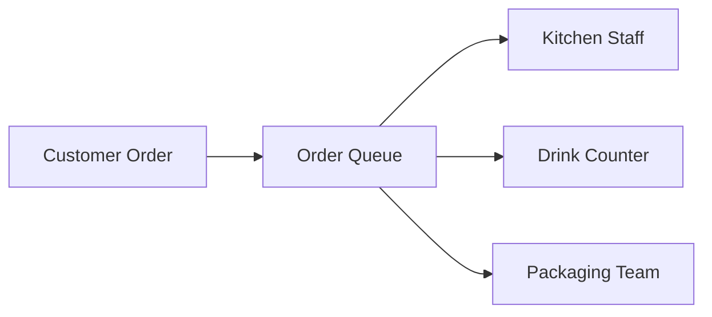
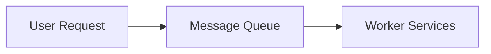
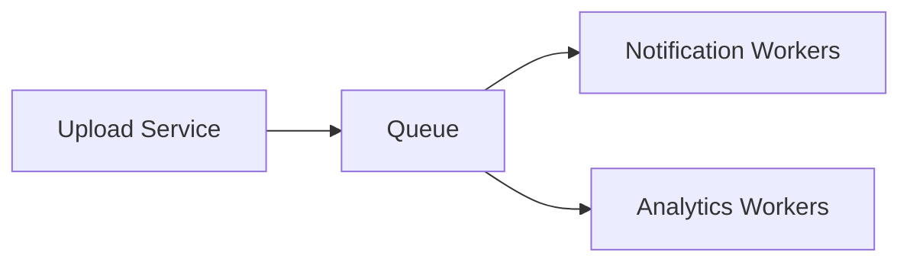
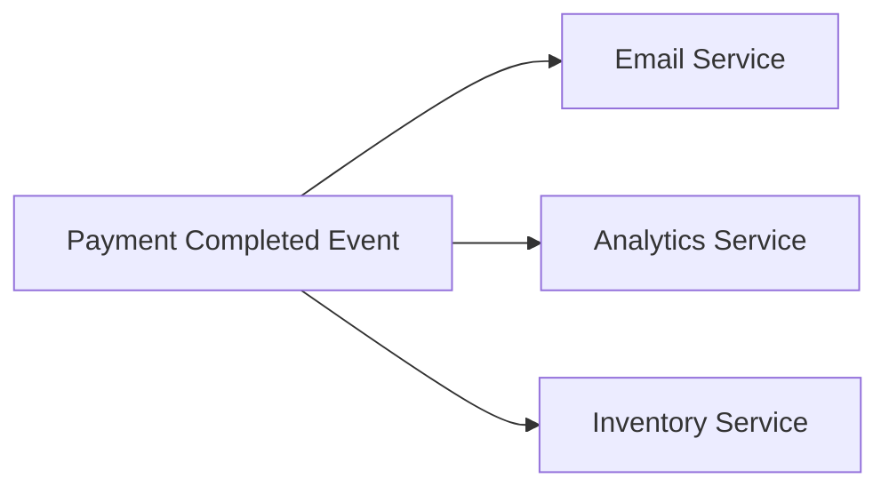
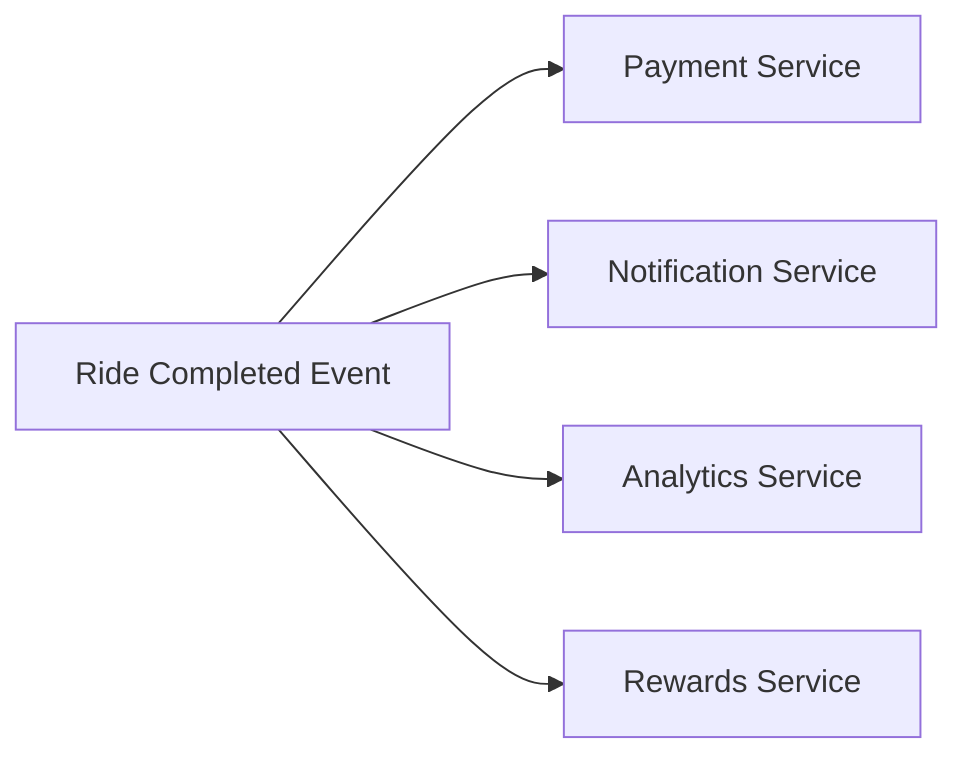
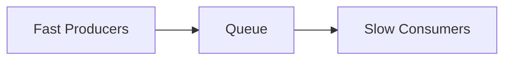

## Message Queues & Event-Driven Systems: How Large Systems Handle Massive Workloads

Imagine posting a photo on Instagram.

At first glance, it feels simple:

- upload image
- save post
- show success message

But behind the scenes, the system may also need to:

- generate thumbnails
- notify followers
- run moderation checks
- update recommendations
- trigger analytics
- store backups
- update feeds

Now imagine millions of users doing this simultaneously.

If every operation happened synchronously during the request:

the system would become painfully slow.

This is where one of the most important patterns in distributed systems appears:

### Message Queues and Event-Driven Architecture

Without them:

- modern internet systems would struggle to scale
- traffic spikes would overwhelm services
- tightly coupled architectures would become fragile

---

### The Core Problem: Not All Work Must Happen Immediately

One of the biggest mistakes beginners make:

> treating every operation as part of the user request.

But large systems separate work into:

| Type | Requirement |
|---|---|
| Critical work | Must happen immediately |
| Background work | Can happen later |

This distinction changes architecture completely.

---

### Real-World Analogy: Restaurant Order System

Imagine a restaurant.

Customers place orders at the counter.

Now suppose the cashier also tries to:

- cook food
- prepare drinks
- package items
- wash utensils

while customers wait.

The line becomes chaotic.

Instead restaurants separate responsibilities:



The queue decouples:
- order intake
- task execution

This is exactly what message queues do in distributed systems.

---

### What Is a Message Queue?

A message queue is:

> A temporary buffer that stores tasks until another system processes them.

Instead of:


modern systems often do:



Now:
- requests return faster
- systems become decoupled
- workloads become manageable

---

### Why Queues Matter So Much at Scale

Queues solve multiple critical problems simultaneously.

---

**1\. They Reduce User Latency**

Users care about responsiveness.

Suppose video upload processing takes:
- 30 seconds

Should the user wait?

No.

Instead:
- upload succeeds quickly
- processing happens asynchronously

Queues make systems feel fast.

---

**2\. They Absorb Traffic Spikes**

Traffic is rarely stable.

Example:

A celebrity posts something.

Suddenly:
> millions of notifications must be sent

Without queues:

notification systems may collapse instantly.

With queues:
- requests accumulate safely
- workers process gradually

Queues act like shock absorbers for traffic spikes.

---

**3\. They Decouple Services**

Without queues:

services directly depend on each other.

Example:


Now if analytics fails:

everything behind it may slow down.

With queues:



Failures become isolated.

This dramatically improves resilience.

---

**4\. They Enable Independent Scaling**

Different workloads grow differently.

Example:
- upload service receives moderate traffic
- notification system handles enormous fanout

Queues allow independent scaling of consumers.

This is a major architectural advantage.

---

### Producers and Consumers

Message queue systems usually involve two major components.

---

#### Producer

The producer creates messages.

Example:
- order placed
- photo uploaded
- payment completed

---

#### Consumer

The consumer processes messages.

Example:
- send notification
- generate thumbnail
- update analytics

This separation is the foundation of event-driven systems.

---

### Event-Driven Architecture

Once systems heavily rely on queues:

architecture begins changing fundamentally.

Instead of direct communication:

systems communicate through events.



One event triggers multiple independent systems.

This creates highly scalable architectures.

---

### Why Event-Driven Systems Became Popular

As systems scale:

tight coupling becomes dangerous.

Direct synchronous communication introduces:
- cascading failures
- high latency
- operational fragility

Event-driven systems reduce this coupling dramatically.

This is why companies like:
- Uber
- Netflix
- Amazon

heavily use asynchronous architectures.

---

### Real-World Example: Uber Ride Completion

When a ride completes:

many things happen:
- payment processing
- receipt generation
- driver earnings update
- analytics update
- loyalty rewards
- notifications

Doing everything synchronously would slow the user experience.

Instead:



This architecture scales far better.

---

### Queue Persistence Matters

Suppose a consumer crashes.

Should tasks disappear?

No.

Reliable queues persist messages safely until processed successfully.

This is critical for:
- payment systems
- order processing
- notifications
- financial workflows

Durability becomes extremely important.

---

### At-Least-Once Delivery

Many queue systems guarantee:

> Messages will be delivered at least once.

But sometimes duplicates may occur.

This introduces another engineering challenge:

**Idempotency**

Consumers must safely handle duplicate messages.

Example:

A payment consumer should not charge twice if the same event arrives again.

This is one of the most important distributed systems concepts.

---

### Ordering Problems in Distributed Queues

Ordering sounds simple.

At scale, it becomes difficult.

Suppose:

```text
Event 1: User created
Event 2: User updated
```

What if Event 2 arrives first?

Now systems may behave incorrectly.

Some workloads require strict ordering.

Others tolerate relaxed ordering.

Again:

trade-offs shape architecture.

---

### Dead Letter Queues (DLQ)

What happens if message processing repeatedly fails?

Example:
- corrupted payload
- invalid data
- crashing consumer

Without protection:
- queues may retry forever.

Modern systems use:

**Dead Letter Queues**

Failed messages move into isolated storage for later debugging.

This improves system stability significantly.

---

### Kafka vs RabbitMQ (High-Level Understanding)

Two common queue technologies solve different problems.

---

#### RabbitMQ

Optimized for:
- traditional message queues
- task processing
- routing flexibility
- reliable job handling

Common in:
- business workflows
- background processing

---

#### Kafka

Optimized for:
- massive event streams
- high throughput
- distributed event pipelines

Used heavily for:
- analytics
- logs
- streaming systems
- real-time data platforms

Kafka behaves more like a distributed event log than a simple queue.

---

### Queue Backpressure

One important challenge:

What happens when producers generate messages faster than consumers process them?



Now queues grow rapidly.

This creates:
- latency spikes
- memory pressure
- infrastructure stress

This is called backpressure.

Large systems must carefully control it.

---

### Why Async Systems Feel More Scalable

Synchronous systems tightly couple:
- request speed
- processing speed

Asynchronous systems separate them.

This creates:
- flexibility
- resilience
- traffic smoothing
- independent scaling

This is one reason modern architectures heavily favor asynchronous processing.

---

### But Event-Driven Systems Introduce Complexity

Queues solve many problems.

But introduce new ones:
- debugging becomes harder
- tracing flows becomes difficult
- eventual consistency increases
- ordering problems appear
- retries become complex

This is the recurring pattern in distributed systems:

> Every scalability improvement introduces operational complexity.

---

### The Bigger Lesson

Message queues teach one of the most important ideas in system design:

> Systems scale better when work is decoupled.

Instead of tightly connecting everything:

large architectures communicate through events and asynchronous workflows.

This creates systems that are:
- resilient
- scalable
- fault tolerant
- adaptable under load

---

### Practical Engineering Mindset

Good engineers ask:
- Does this task really need to happen synchronously?
- Can this work happen asynchronously?
- What happens during traffic spikes?
- What if consumers fail?
- How are retries handled?
- What happens if duplicate events occur?

These questions shape real-world distributed systems.

---

### Final Takeaway

Message queues and event-driven systems are foundational to modern scalable architecture.

They allow systems to:
- process massive workloads
- survive traffic spikes
- reduce coupling
- improve resilience
- scale independently

But they also introduce new distributed systems challenges:
- retries
- ordering
- consistency
- observability
- idempotency

Understanding these trade-offs is critical for designing systems that operate reliably at scale.

---

### In the Next Blog

Now that we understand how large systems process workloads asynchronously, the next question becomes:

👉How should services themselves be organized as systems grow larger?

In the next article, we’ll explore Monoliths vs Microservices, and understand why breaking systems into smaller services is both powerful and dangerous at the same time.
