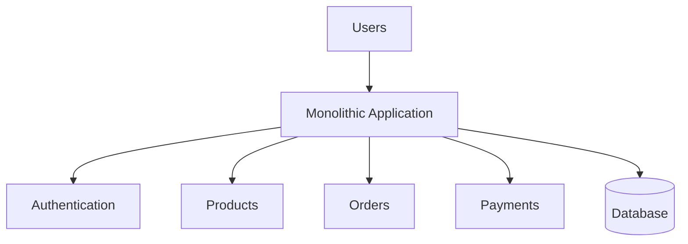
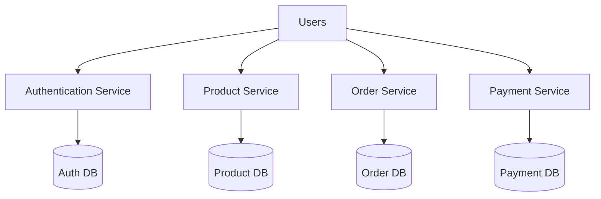

## Monolith vs Microservices: The Truth Most Engineers Learn Too Late

Ask a new developer:

> "What architecture should a scalable system use?"

And you'll often hear:

> "Microservices."

Not because they've experienced the problems microservices solve.

But because nearly every architecture discussion online eventually points toward:

- Netflix
- Amazon
- Uber
- Google

And most of those companies use microservices.

This creates a dangerous assumption:

> If big companies use microservices, then microservices must be the best architecture.

But real engineering is rarely that simple.

In fact:

Many successful systems begin their journey as monoliths.

Understanding why is one of the most valuable lessons in software architecture.

---

### Before We Compare Them

Let's understand what problem architecture is trying to solve.

Every application eventually grows.

What starts as:

- a few APIs
- a small database
- one deployment

can become:

- hundreds of APIs
- multiple teams
- millions of users

The architecture determines:

- how the system evolves
- how teams collaborate
- how failures propagate
- how scaling happens

Architecture is less about technology.

And more about managing complexity.

---

### What Is a Monolith?

A monolith is an application where everything exists in a single deployable unit.

For example:

```text
E-Commerce Application

- Authentication
- Products
- Orders
- Payments
- Notifications
```

All packaged together.

All deployed together.

All running together.

---

A simplified view:



Everything lives inside one application boundary.

---

### Why Monoliths Are So Popular

Because they're simple.

And simplicity is powerful.

A monolith offers:
- easier development
- simpler deployments
- easier debugging
- fewer moving parts

For small teams:

this is incredibly valuable.

---

### The Hidden Advantage of Monoliths

Many engineers underestimate this.

Inside a monolith:

components communicate through:

- function calls
- method calls
- local memory

This is extremely fast.

No network involved.

No serialization.

No distributed failures.

No retries.

No timeouts.

This simplicity is often worth far more than people realize.

---

### Why Startups Often Begin With Monoliths

Imagine a startup.

They have:

- 3 engineers
- one product
- limited funding

Their biggest problem is usually:

not scale.

It's finding product-market fit.

A monolith allows them to:

- move quickly
- ship features faster
- reduce operational complexity

This is why many successful companies started with monoliths.

Including companies that later became famous for microservices.

---

### When Monoliths Begin To Struggle

As systems grow:

complexity accumulates.

Eventually:

one codebase contains:

- thousands of files
- hundreds of APIs
- multiple teams

Now new challenges emerge.

---

### Problem 1: Large Deployments

A tiny change in one module may require:

deploying the entire application.

Example:
```text
Changed:
Notification Logic

Must Deploy:
Entire Application
```
Risk increases.

Deployment time increases.

Operational overhead increases.

---

### Problem 2: Team Coordination

Suppose:

- Team A works on Orders
- Team B works on Payments
- Team C works on Authentication

All sharing the same codebase.

Now:

- dependencies increase
- merge conflicts increase
- release coordination becomes difficult

The architecture begins affecting organizational efficiency.

---

### Problem 3: Scaling Limitations

Imagine:

Orders generate massive traffic.

Payments generate moderate traffic.

Authentication generates low traffic.

With a monolith:

you often scale everything together.


This may waste resources.

---

### Enter Microservices

Microservices attempt to solve these challenges.

The idea is simple:

Break the system into smaller independent services.

Example:


Each service:
- owns a specific responsibility
- can be deployed independently
- can scale independently

---

### Why Microservices Became Popular

Because they solve real organizational problems.

They enable:
- independent teams
- independent deployments
- independent scaling

At large scale this becomes extremely valuable.

---

### The Biggest Benefit: Team Autonomy

Consider Amazon.

Thousands of engineers work simultaneously.

A single monolithic codebase would become difficult to manage.

Microservices allow teams to:
- own their services
- deploy independently
- evolve independently

Architecture begins matching organizational structure.

---

### Independent Scaling

Suppose:

Order traffic increases 10x.

With microservices:


No need to scale:
- payments
- authentication
- notifications

This improves efficiency.

---

### The Cost Nobody Talks About

Microservices solve many problems.

But they introduce entirely new categories of complexity.

---

### Network Failures

Inside a monolith:
```text
Function Call
```

Inside microservices:
```text
Network Request
```

And networks fail.

Unexpectedly.

Frequently.

At scale:

network failures become normal.

---

### Latency Increases

A local function call may take:

```microseconds.```

A network call may take:

```milliseconds.```

Now every request travels across services.

Latency accumulates.

---

Debugging Becomes Harder

Monolith:
```text
One Application
One Log Stream
```

Microservices:
```text
20 Services
20 Log Streams
20 Deployments
```

Tracing failures becomes much harder.

---

### Distributed Data Challenges

One database is simple.

Multiple databases create challenges:
- synchronization
- consistency
- transactions

Questions become harder:

What happens if:
- payment succeeds
- order creation fails?

Welcome to distributed systems.

---

### The Most Common Mistake

Many teams adopt microservices too early.

They see:
- Netflix architecture diagrams
- conference talks
- cloud-native trends

And assume:

> We need this too.

But architecture should solve current problems.

Not future imaginary ones.

---

### A Better Evolution Path

Many successful systems follow:

```text
Simple Monolith
        ↓
Modular Monolith
        ↓
Extract High-Value Services
        ↓
Microservices
```

Notice:

Microservices are often the destination.

Not the starting point.

---

### Monolith vs Microservices Is The Wrong Question

A better question is:
> What level of complexity does my system currently need?

Because architecture is contextual.

A startup and Amazon have completely different constraints.

Therefore they require different solutions.

---

### The Bigger Lesson

Architecture is about trade-offs.

Monoliths optimize for:
- simplicity
- speed of development
- operational ease

Microservices optimize for:
- scalability
- autonomy
- organizational growth

Neither is universally superior.

---

### Practical Engineering Mindset

Good architects ask:
- How many engineers exist?
- How complex is the product?
- What scaling challenges exist?
- What deployment pain exists?
- What business problems are we solving?

These questions matter more than trends.

---

### Final Takeaway

Microservices are not an upgrade from monoliths.

They are a trade-off.

Monoliths reduce complexity.

Microservices distribute complexity.

The goal is not choosing the most advanced architecture.

The goal is choosing the architecture that allows your team to move efficiently today while supporting tomorrow's growth.

And often:

> The best architecture is the simplest one that successfully solves your current problem.

---

### In the Next Blog

Now that we understand how systems are organized internally, the next question becomes:

> How do dozens or hundreds of services communicate without creating chaos?

In the next article, we'll explore the API Gateway Pattern, one of the most important architectural patterns in modern distributed systems.
