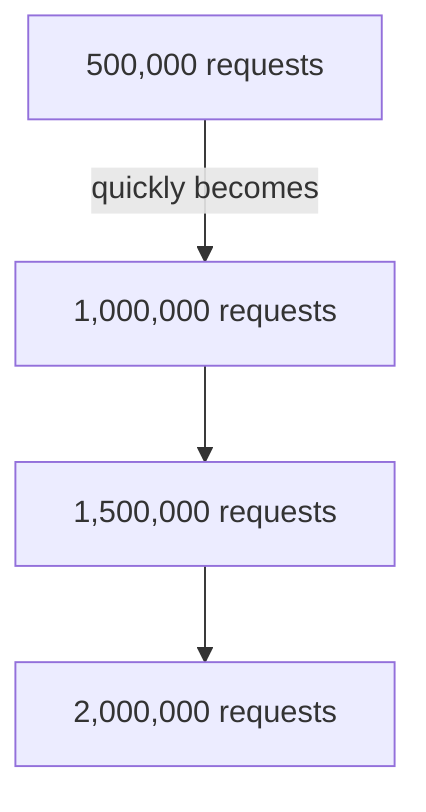
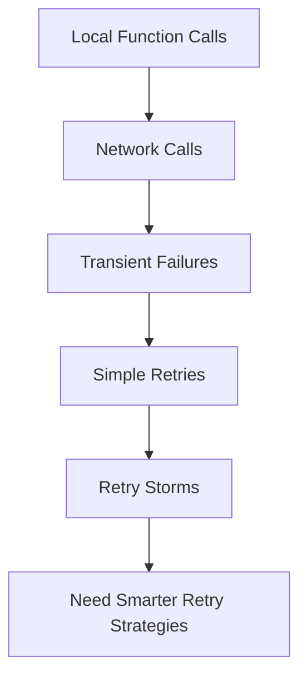
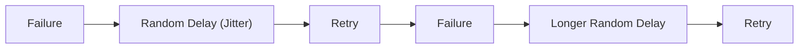

## Retry Pattern: Why "Just Retry It" Is Rarely the Right Strategy

**Previously...**

In the previous blog, we explored one of the most important resilience patterns in distributed systems **Circuit Breaker**.

We saw how one slow dependency can gradually consume thread pools, exhaust connection pools, and trigger cascading failures across an entire platform.

The Circuit Breaker protects systems by recognizing when a dependency is unhealthy and temporarily stopping requests from reaching it.

But during that discussion, an important question naturally emerged.

If repeatedly retrying a failing service can make an outage worse...

Should we stop retrying altogether?

The answer is no.

In fact, retries are one of the most effective techniques for improving reliability.

The challenge isn't deciding **whether** to retry.

The challenge is knowing **how**.

---

### A Production Incident

It's Friday evening.

Traffic is higher than usual.

A customer clicks **Pay Now**.

The Payment Service sends a request to the payment gateway.

The request times out.

One second later...

The customer clicks the button again.

The application retries.

This time it succeeds.

The customer receives their confirmation.

Everything seems fine.

Now imagine something slightly different.

Instead of one customer...

There are **500,000 customers**.

And instead of one timeout...

The payment provider is experiencing intermittent latency.

Suddenly every application instance starts retrying immediately.

What was originally:



The retry mechanism itself becomes one of the largest sources of traffic.

Ironically...

The system designed to improve reliability is now making recovery even harder.

---

### Why Retries Exist

Not every failure means something is broken.

Sometimes failures are temporary.

Imagine these situations:

- A network packet gets dropped.
- DNS resolution briefly fails.
- A load balancer is switching traffic.
- A service restarts.
- A database leader election takes a few seconds.

If the application simply gives up after the first failure...

Users experience unnecessary errors.

A second attempt often succeeds.

This is exactly why retries exist.

They help recover from **transient failures**.

---

### A Real-World Analogy

Imagine calling a friend.

They don't answer.

Maybe they're:

- in another room
- driving
- temporarily busy

Calling once more after a short pause is reasonable.

Calling them fifty times in the next ten seconds...

isn't.

Retries work the same way.

The problem isn't retrying.

The problem is **retrying without thinking.**

---

### Why Immediate Retries Are Dangerous

Suppose a service responds slowly because it's overloaded.

The worst thing you can do is immediately send another request.

That second request arrives while the first problem still exists.

Now imagine thousands of clients doing exactly the same thing.

Instead of helping recovery...

they create even more work.

This creates what's known as a **retry storm**.

A retry storm is often more damaging than the original failure.

---

**Stop & Think**

Imagine you're carrying heavy boxes upstairs.

You're already exhausted.

Would it help if ten more people suddenly handed you even more boxes?

Probably not.

Sometimes the fastest path to recovery is simply having a little breathing room.

Distributed systems are no different.

---

### How This Problem Emerged

In monolithic applications, retries were rarely discussed.

Most operations happened within a single process.

Function calls were fast.

Reliable.

Cheap.

Microservices changed that.

Every operation became a network call.

And networks fail in ways that local function calls never do.

Transient failures became part of normal operation.

Engineers needed a way to recover automatically without overwhelming already struggling services.

That need led to smarter retry strategies.

---

### Architecture Evolution



---

### Where We Go Next

We've established that retries are useful.

We've also seen how poorly designed retries can amplify failures instead of recovering from them.

So the real question becomes:

If immediate retries are dangerous...

**What does a good retry strategy actually look like?**

---

### So, What Is the Retry Pattern?

At its core, the Retry Pattern is incredibly simple.

If an operation fails because of a temporary problem...

try it again.

That's it.

But here's the catch.

The Retry Pattern isn't about **retrying**.

It's about **retrying intelligently**.

The difference between those two approaches is often the difference between a resilient system and a platform-wide outage.

---

### Which Failures Should Be Retried?

One of the biggest misconceptions is that every failure deserves another attempt.

It doesn't.

Consider these examples.

**Experienced Candidates for Retry**

- Temporary network timeout
- DNS lookup failure
- Service temporarily unavailable (HTTP 503)
- Rate limited (HTTP 429)
- Database leader election
- Short-lived infrastructure restart

These failures are often temporary.

Waiting a little while gives the system time to recover.

---

**Freshers Candidates for Retry**

- Invalid password
- Authentication failure (401)
- Permission denied (403)
- Validation errors (400)
- Resource not found (404)
- Invalid payment details

Retrying these requests won't magically change the outcome.

The request itself is incorrect.

No amount of retries can fix bad input.

One of the first lessons in resilience engineering is:

> **Retry the failure-not the mistake.**

---

### The Simplest Retry Strategy

Many developers write something like this.

```java
for (int i = 0; i < 3; i++) {
    try {
        callPaymentService();
        break;
    } catch (Exception e) {
    }
}
```

It looks harmless.

But notice something.

The retries happen immediately.

If the dependency is already overloaded...

you're simply adding more work.

---

### Why Waiting Matters

Imagine you're standing in a supermarket queue.

The cashier says:

> "Please wait a minute while I restart the billing system."

Would you immediately ask again?

Probably not.

You'd wait.

Distributed systems behave the same way.

Recovery takes time.

Retrying immediately often guarantees another failure.

---

### Exponential Backoff

Instead of retrying instantly,

the application waits longer after each failure.

For example:

```text
Retry 1 → 1 second

Retry 2 → 2 seconds

Retry 3 → 4 seconds

Retry 4 → 8 seconds
```

Each retry gives the dependency a little more breathing room.

This strategy is called **Exponential Backoff**.


Notice something.

We're not reducing retries.

We're spreading them out.

That simple change dramatically reduces pressure on recovering systems.

---

### But There's Still a Problem...

Imagine one million users all experience the same timeout.

Every application uses exponential backoff.

Everyone retries after:

```text
1 second
```

Then:

```text
2 seconds
```

Then:

```text
4 seconds
```

What happens?

Every client retries at exactly the same time.

You have accidentally synchronized millions of users.

The result?

Another traffic spike.

---

### Introducing Jitter

Jitter solves this problem by adding randomness.

Instead of waiting exactly:

```text
2 seconds
```

Each client waits something slightly different.

For example:

```text
1.7 s

2.3 s

1.9 s

2.6 s

2.1 s
```

Now requests become naturally distributed.

Instead of a traffic spike,

the recovering service receives a steady stream of requests.

This significantly improves recovery.

---

### Exponential Backoff with Jitter

This is the strategy recommended by companies like Amazon because it prevents clients from retrying in lockstep.



The exact numbers aren't important.

The idea is.

Spread retries over time.

---

**Stop & Think**

Imagine a concert ends.

Would you rather:

10,000 people leave through one exit at exactly the same moment...

Or everyone leave gradually over the next fifteen minutes?

Jitter does for distributed systems what crowd management does for stadiums.

It spreads traffic naturally.

---

### Retry Limits

Should applications retry forever?

Definitely not.

Eventually,

every application must stop trying.

Most production systems define:

- maximum retry count
- maximum retry duration
- overall timeout

For example:

```text
Maximum Retries

3

Maximum Total Time

15 seconds
```

Once those limits are reached,

the request fails gracefully.

---

### Idempotency Matters

Imagine this request:

```text
Transfer ₹10,000
```

The payment succeeds.

But the response is lost.

The client thinks it failed.

It retries.

Without protection,

the customer might now transfer ₹20,000.

This is why retries and **idempotency** are closely connected.

An idempotent operation produces the same result no matter how many times it's repeated.

Payment systems often use an **Idempotency Key**.

```text
Request

ID: abc123
```

If the same request arrives again,

the server recognizes it and returns the original result instead of processing it twice.

Retries become safe because duplicate requests no longer create duplicate side effects.

---

### Retry + Timeout + Circuit Breaker

These patterns are strongest when they work together.


Each pattern answers a different question.

| Pattern | Question |
|----------|----------|
| Timeout | How long should we wait? |
| Retry | Should we try again? |
| Circuit Breaker | Should we stop trying entirely? |

Together they form the foundation of resilient communication.

---

### Production Reality

Modern cloud platforms don't rely on retries alone.

They combine:

- retries
- exponential backoff
- jitter
- timeouts
- circuit breakers
- idempotency
- observability

Each pattern compensates for the limitations of the others.

Resilience isn't one feature.

It's an ecosystem of small, carefully designed mechanisms.

---

### Common Mistakes

**Mistake 1**

Retrying every error.

Some failures are permanent.

---

**Mistake 2**

Retrying immediately.

Immediate retries often amplify outages.

---

**Mistake 3**

No retry limit.

Infinite retries create endless pressure.

---

**Mistake 4**

Ignoring idempotency.

Retries without idempotency can duplicate business operations.

---

**Mistake 5**

Using identical retry schedules.

Without jitter,

clients tend to synchronize and create retry storms.

---

### When NOT to Retry

Avoid retries when:

- input validation failed
- authentication failed
- authorization failed
- business rules rejected the request
- duplicate operations would be dangerous

Retries should only target failures that have a realistic chance of succeeding later.

---

### Interview Perspective

A common interview question is:

> "Why isn't exponential backoff enough?"

Because every client still retries on the same schedule.

Jitter introduces randomness, preventing synchronized retry spikes.

Another question:

> "Why do payment APIs often require idempotency keys?"

Because network failures can make clients retry requests even after the server has successfully processed them.

Without idempotency, duplicate retries could produce duplicate payments.

---

### Final Takeaway

The Retry Pattern exists because not every failure is permanent.

Networks fail.

Services restart.

Infrastructure changes.

Sometimes waiting just a little longer is all that's needed.

But retries must be designed carefully.

Poor retry strategies amplify failures.

Good retry strategies quietly recover from them without users ever noticing.

The goal isn't to retry more.

The goal is to retry smarter.

---

### In the Next Blog

Retries help recover from temporary failures.

But before you can decide **whether** to retry, you need to decide **how long you're willing to wait**.

Should a service wait:

- 500 milliseconds?
- 5 seconds?
- 30 seconds?
- Forever?

Waiting too little may fail healthy requests.

Waiting too long can exhaust threads, increase latency, and trigger cascading failures.

In the next article, we'll explore the **Timeout Pattern**-the first line of defense in every resilient distributed system.
