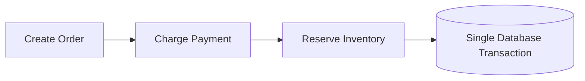
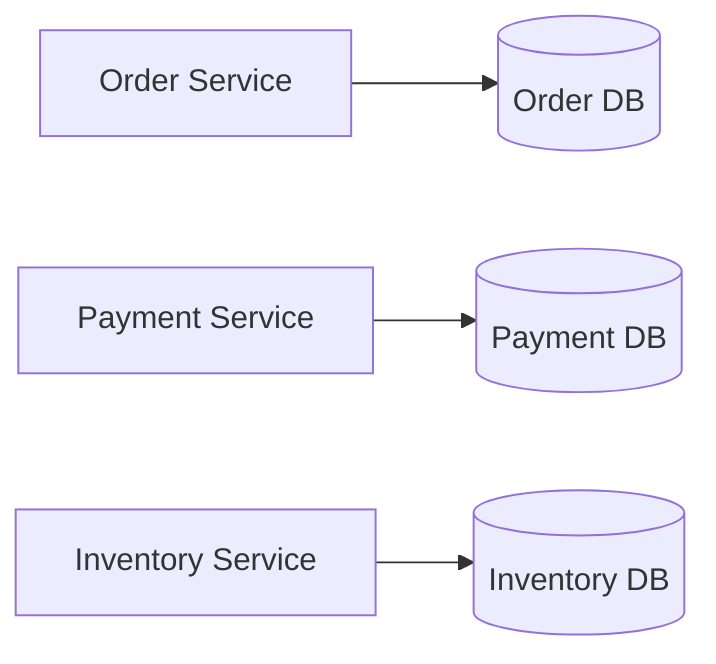
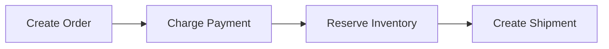
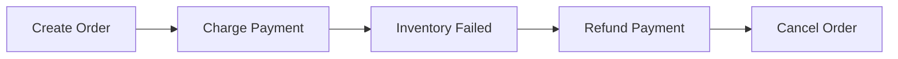
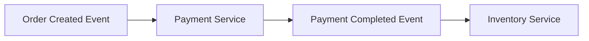
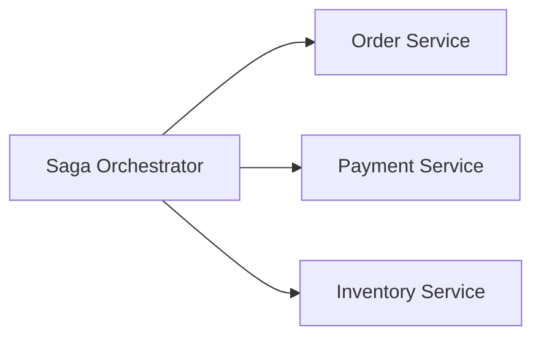

## Saga Pattern: Managing Distributed Transactions Without a Shared Database

In the previous article, we learned why mature microservice architectures avoid sharing a single database.

Every service owns its own data.

That sounds great.

Until one business operation needs multiple services.

Imagine placing an order on Amazon.

It isn't just one database operation.

Behind a single **"Place Order"** button, several independent services may work together:

- Order Service
- Payment Service
- Inventory Service
- Shipping Service
- Notification Service

Each owns its own database.

Each is deployed independently.

Each can fail independently.

Now imagine this sequence:

- Order created
- Payment successful
- Inventory update fails

What should happen next?

This is one of the hardest problems in distributed systems.

---

### The World Before Microservices

In a monolithic application, this problem was relatively simple.

Everything shared one database.

A single transaction could wrap the entire operation.



If anything failed:

Everything rolled back.

Either all changes happened.

Or none did.

This is called an **ACID transaction**.

It works beautifully...

As long as everything lives inside one database.

---

### The Problem Microservices Introduced

Now imagine the same operation.

Except every service owns its own database.



Suddenly:

There is no single transaction anymore.

Each database commits independently.

This changes everything.

---

### Why Traditional Transactions Don't Scale

You might ask:

> "Why can't we just create one transaction across all databases?"

Technically, there are protocols like **Two-Phase Commit (2PC)**.

But at internet scale they introduce serious problems:

- higher latency
- blocking operations
- reduced availability
- coordination overhead
- poor fault tolerance

Large distributed systems generally avoid them.

Instead...

They embrace a different philosophy.

---

### The Shift in Thinking

Instead of asking:

> "How do we prevent partial failures?"

Distributed systems ask:

> "How do we recover from partial failures?"

That shift gave birth to the Saga Pattern.

---

### What Is a Saga?

A Saga is:

> A sequence of local transactions where each successful step triggers the next one.

If one step fails:

The system executes **compensating actions** to undo previous work.

Think of it as:

Not one giant transaction.

But many smaller transactions working together.

---

### Real-World Analogy: Booking a Vacation

Imagine planning a vacation.

You:

1. Book a flight.
2. Reserve a hotel.
3. Rent a car.

Now suppose:

The car rental fails.

What do you do?

You don't leave everything half-finished.

You cancel:

- the hotel
- the flight

Those cancellations are **compensating actions**.

This is exactly how a Saga works.

---

### Saga Flow



Everything succeeds.

Perfect.

Now imagine inventory fails.



Instead of rolling back a database transaction...

We perform business-level undo operations.

---

### Rollback Is Different Now

One of the biggest mindset shifts is this:

A Saga doesn't roll back a database.

It rolls back business operations.

Example:

Database rollback:

```text
DELETE inserted row
```

Saga compensation:

```text
Issue customer refund
Cancel shipment
Release reserved inventory
```

These are business actions.

Not SQL operations.

---

### How This Pattern Emerged

Companies like Amazon couldn't rely on one massive database transaction.

Their services were:

- independently deployed
- geographically distributed
- constantly evolving

Traditional transaction models became impractical.

The industry moved toward:

- asynchronous communication
- eventual consistency
- compensating workflows

This evolution naturally led to the Saga Pattern.

---

### Two Ways to Implement a Saga

**1. Choreography**

Each service reacts to events.



No central coordinator.

Simple initially.

But difficult to visualize as systems grow.

---

**2. Orchestration**

A central Saga Orchestrator manages the workflow.



The orchestrator decides:

- what happens next
- how failures are handled
- when compensation begins

Many enterprise systems prefer this approach because it's easier to monitor.

---

### Compensation Is Not Free

Undoing business actions can be surprisingly difficult.

Imagine:

- customer already received confirmation
- inventory already updated elsewhere
- warehouse started packing

Can everything truly be undone?

Sometimes:

No.

Good system design starts thinking about compensation during feature design.

Not afterward.

---

### The Hidden Challenges

Sagas solve distributed transactions.

But introduce new problems:

- duplicate events
- retries
- idempotency
- event ordering
- monitoring long-running workflows

Every distributed pattern solves one problem while creating another.

---

### Practical Engineering Mindset

When designing a distributed workflow ask:

- What happens if step three fails?
- Can previous actions be compensated?
- Is every action idempotent?
- How will operators monitor the workflow?
- What happens if the compensation itself fails?

These questions separate reliable systems from fragile ones.

---

### The Bigger Lesson

The Saga Pattern teaches one of the most important principles in distributed systems:

> Failure is expected.

The architecture is not designed to avoid failure.

It is designed to recover from failure gracefully.

That is a fundamental shift from traditional application design.

---

### Final Takeaway

Once services own their own databases, distributed transactions become unavoidable.

The Saga Pattern replaces one large transaction with a sequence of smaller business transactions connected by compensating actions.

It allows systems to remain:

- scalable
- loosely coupled
- resilient

Not because failures disappear.

But because failures become manageable.

---

### In the Next Blog

Now that we've learned how distributed systems maintain consistency across multiple services, another question naturally arises:

> Why should reads and writes always follow the same path?

In the next article, we'll explore the **CQRS (Command Query Responsibility Segregation)** pattern and see why many high-scale systems separate read and write models.