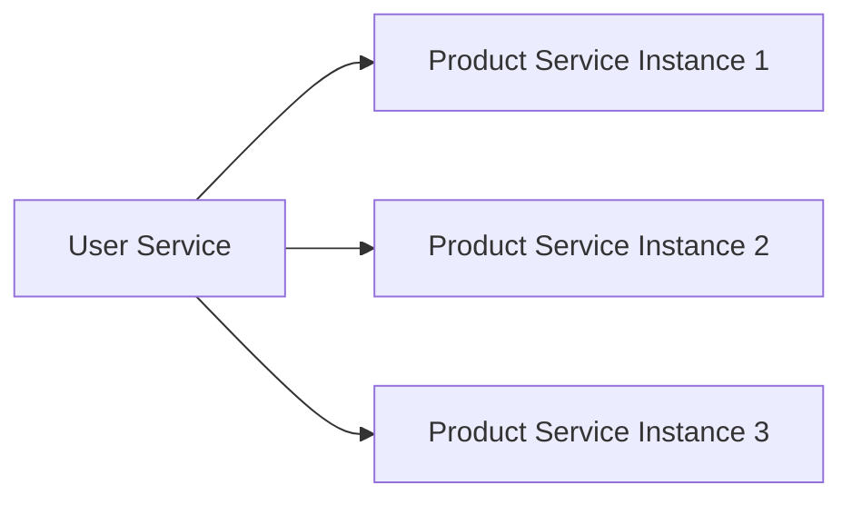
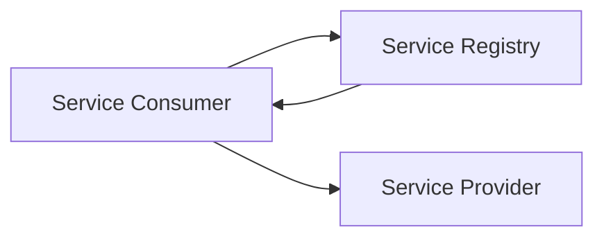
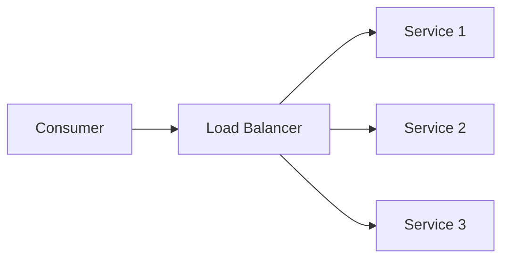

## Service Discovery Pattern: How Services Find Each Other in a Dynamic World

Imagine you're building a small application.

You have:

- User Service
- Product Service

The User Service needs to call the Product Service.

Easy.

Just configure:

```text
http://192.168.1.20:8080
```

Done.

For a small application, this works perfectly.

But modern systems don't stay small.

As systems grow:
- servers get replaced
- containers restart
- instances auto-scale
- infrastructure changes constantly

Now that hardcoded IP address becomes a problem.

A very big problem.

This is where Service Discovery enters the picture.

---

### The Hidden Assumption Most Developers Make

When developers first build distributed systems, they often assume:

> Services live at fixed locations.

But modern infrastructure is dynamic.

Especially in environments like:
- Kubernetes
- AWS ECS
- Docker Swarm
- Cloud platforms

Services are constantly moving.

The system may look stable.

The infrastructure underneath is not.

---

### How This Problem Emerged

Before cloud-native systems became common:

applications often ran on:
- dedicated servers
- static infrastructure

Machines stayed alive for months or years.

Hardcoded addresses were manageable.

Then came:
- containers
- auto-scaling
- elastic infrastructure

Now machines could appear and disappear in seconds.

This changed everything.

The question became:

> How can Service A find Service B if Service B keeps moving?

---

### Real-World Analogy: Mobile Phones

Imagine trying to call a friend.

Years ago you might have known:
- home address
- office address

But today?

People move constantly.

Instead of remembering locations:

you use a contact list.

You search:

```text
John
```

Your phone resolves:

```text
+91-XXXXXXXXXX
```

You don't care where John is.

You care about finding John.

Service Discovery works similarly.

Services ask:

```text
Product Service
```

Instead of:

```text
10.0.1.25
```

---

### The Core Problem

Consider this architecture:


Looks simple.

Now suppose Product Service scales.



Questions immediately arise:
- Which instance should be called?
- How does User Service know available instances?
- What happens if one instance dies?
- What happens when new instances appear?

Hardcoded networking quickly becomes impossible.

---

### What Is Service Discovery?

Service Discovery is:

> A mechanism that allows services to dynamically locate other services.

Instead of knowing:
- IP addresses
- ports
- infrastructure details

Services discover each other through a registry.

---

### Introducing the Service Registry

The central component is usually:

Service Registry

A registry stores information about available services.

Example:
```text
User Service
  → 10.0.0.12

Product Service
  → 10.0.0.15
  → 10.0.0.16
  → 10.0.0.17
```

Services register themselves.

Consumers query the registry.

---

### Basic Workflow


Flow:
1. Product Service starts
2. Registers itself
3. User Service asks registry
4. Registry returns location
5. Communication begins

This makes systems far more flexible.

---

### Why Service Discovery Matters

Without Service Discovery:

every infrastructure change requires:
- configuration updates
- redeployments
- manual intervention

With Service Discovery:

systems adapt automatically.

This becomes critical at scale.

---

### Health Checks Change Everything

Finding services isn't enough.

What if a service crashes?

The registry must know.

Modern service discovery systems continuously perform:
- health checks
- heartbeat monitoring
- availability verification

Example:


If heartbeats stop:

the registry removes the service.

Consumers stop sending traffic there.

This dramatically improves reliability.

---

### Client-Side Service Discovery

One approach:

the client queries the registry directly.



Advantages:
- simple architecture
- direct communication

Disadvantages:
- clients become more complex
- discovery logic spreads across services

---

### Server-Side Service Discovery

Another approach:

use a load balancer.



Now consumers don't need discovery logic.

The load balancer handles it.

This simplifies services significantly.

---

### Real-World Example: Kubernetes

One reason Kubernetes became so popular:

it solves service discovery automatically.

When you create:

```text
kind: Service
```

Kubernetes provides:

```text
product-service.default.svc.cluster.local
```

Services communicate using names.

Not IP addresses.

Behind the scenes Kubernetes handles:
- registration
- discovery
- load balancing
- health checks

This abstraction dramatically simplifies distributed systems.

---

### Service Discovery and Scaling

Imagine:

Product Service scales from:

```text
2 instances
```

to:

```text
200 instances
```

Consumers should not care.

Service Discovery ensures:
- new instances appear automatically
- failed instances disappear automatically
- traffic routing remains seamless

This is a foundational scaling capability.

---

### The Hidden Complexity

Service Discovery solves major problems.

But introduces new challenges.

---

### Registry Availability

What happens if:

the registry itself fails?

Now services may struggle to locate each other.

This is why production registries are often:
- replicated
- distributed
- highly available

The registry becomes critical infrastructure.

---

### Consistency Challenges

Suppose:

a service crashes.

How quickly should it disappear from the registry?

Immediately?

After 5 seconds?

After 30 seconds?

There are trade-offs between:
- responsiveness
- stability
- false failures

Distributed systems always involve trade-offs.

---

### Popular Service Discovery Systems

Historically:
- Consul
- Eureka
- ZooKeeper

were widely used.

Today:
- Kubernetes Services
- Cloud-native discovery systems

handle most modern workloads.

The concept remains the same.

The implementation evolves.

---

### The Bigger Lesson

Service Discovery teaches an important distributed systems principle:

Infrastructure should be dynamic, but communication should feel stable.

Services should not care:
- where other services run
- how many instances exist
- which machines are alive

They should simply request:

```text
Product Service
```

and trust the platform to find it.

This abstraction is what makes large distributed systems manageable.

---

### Practical Engineering Mindset

When designing distributed systems ask:
- Will service locations change?
- Will auto-scaling exist?
- How will failures be detected?
- How will new instances become discoverable?

If the answer is yes:

Service Discovery becomes essential.

---

### Final Takeaway

Service Discovery is one of the foundational patterns of modern distributed systems.

It allows systems to:
- adapt dynamically
- scale automatically
- recover from failures
- simplify communication

Without it, modern cloud-native architectures would become extremely difficult to operate.

Because at scale:

> The hardest part is often not running services.

It's helping them find each other.

---

### In the Next Blog

Now that services can find each other dynamically, a new challenge emerges:

> Should every service share the same database?

In the next article, we'll explore the Database Per Service Pattern, one of the most important architectural decisions in microservice design.
