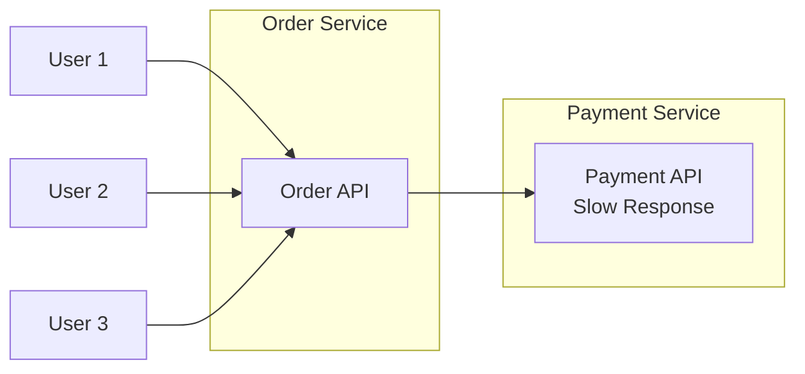
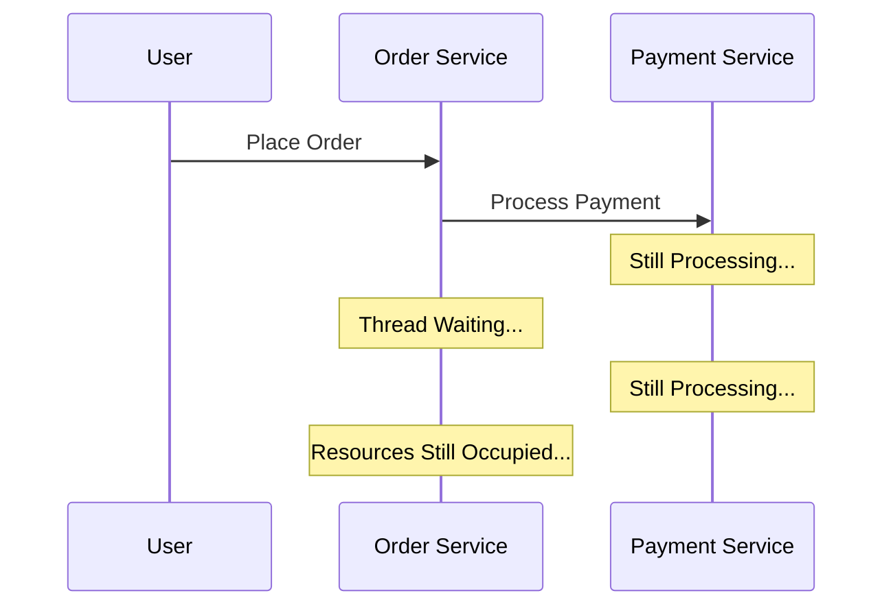
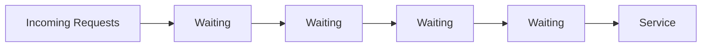
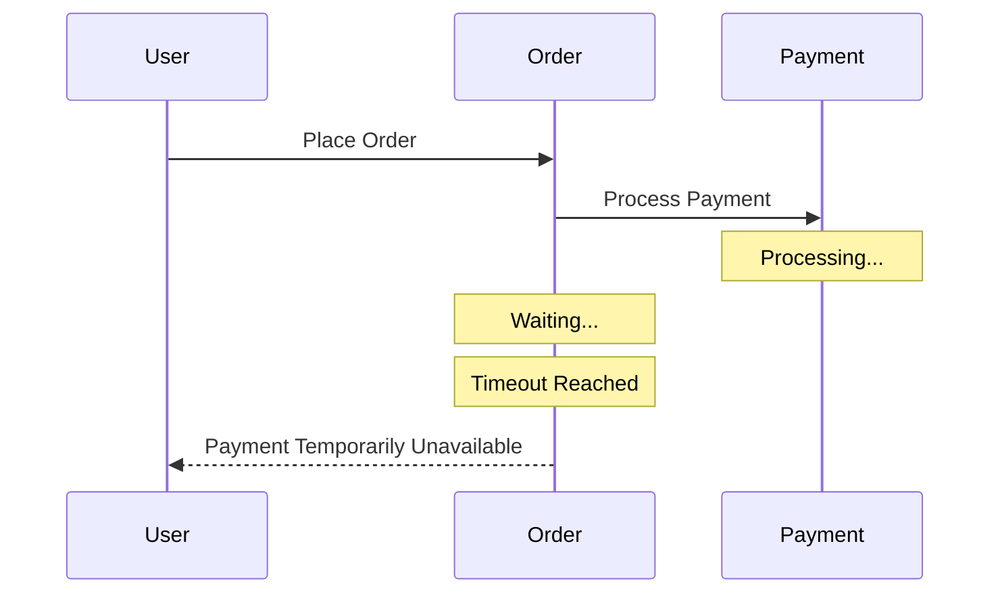
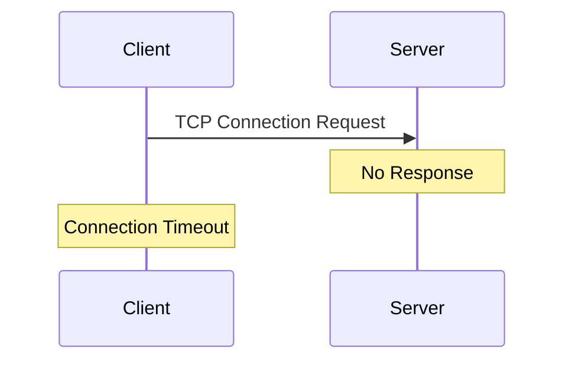
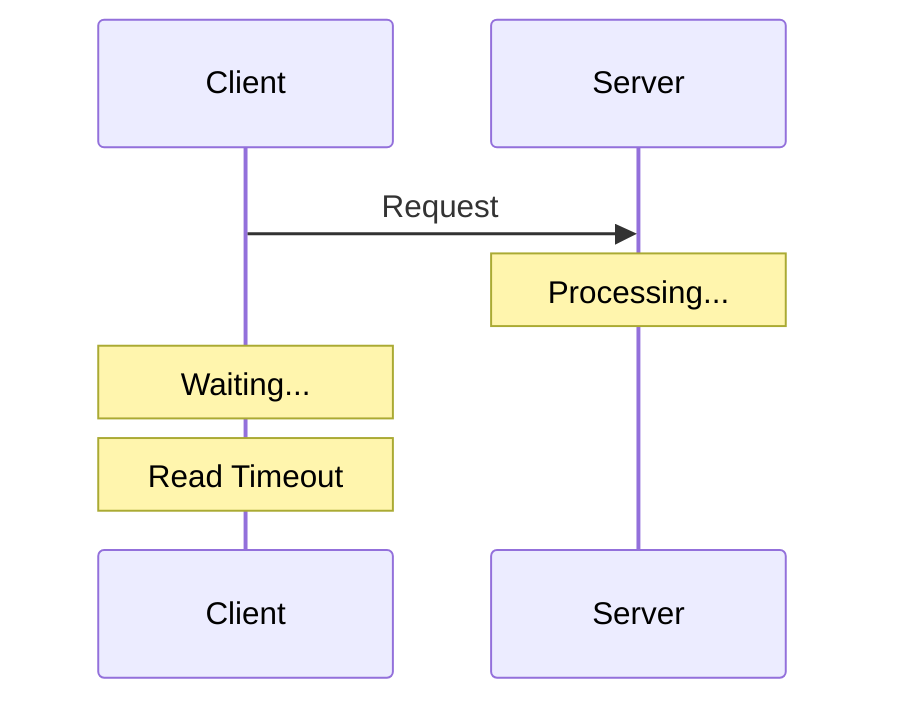
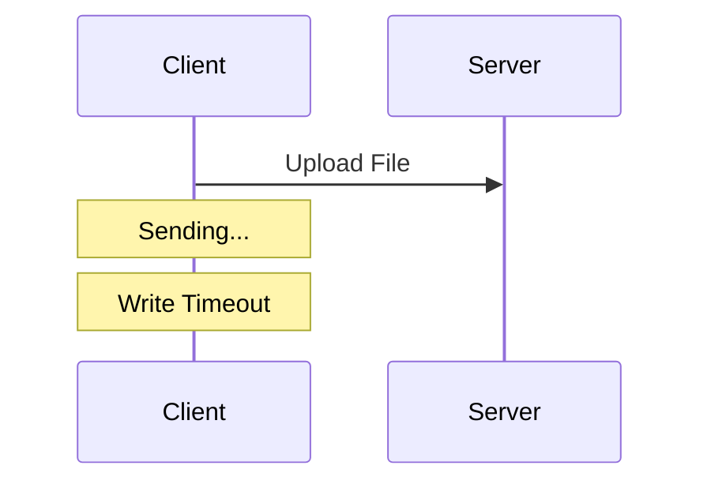
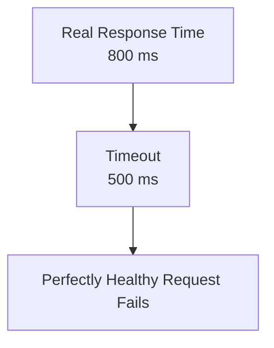
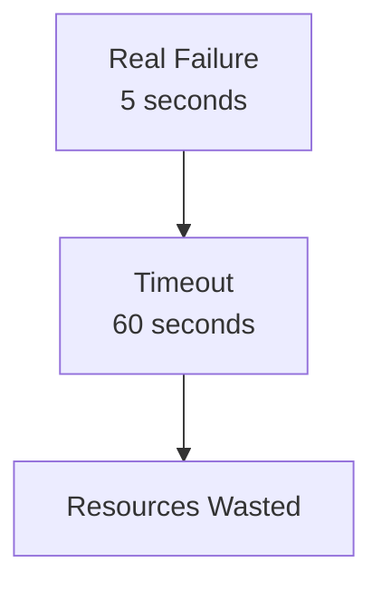
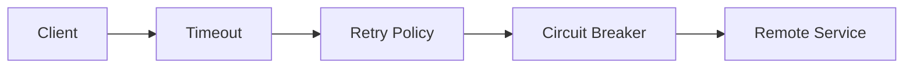

## Timeout Pattern: Why Waiting Too Long Can Crash Your System

**Previously...**

In the previous article, we explored the **Retry Pattern** and discovered that retries aren't simply about trying again.

A well-designed retry strategy asks several questions before sending another request.

- Should this request be retried?
- How many times?
- How long should we wait?
- Is the operation safe to retry?

We also learned that retries usually work alongside techniques like exponential backoff, jitter, idempotency, and circuit breakers.

But there's one question we intentionally ignored.

**How long should a request wait before deciding something is wrong?**

That question leads us to one of the simplest and most important patterns in distributed systems.

The **Timeout Pattern**.

---

### A Production Incident

It's Monday morning.

Your e-commerce platform has just launched a major sale.

Thousands of customers are placing orders every second.

Everything looks healthy.

Until one small service becomes slow.

Not unavailable.

Just...

slower than usual.

The Order Service sends a request to the Payment Service.

It waits.

The Payment Service is still processing.

Another customer places an order.

Another request starts waiting.

Soon there are thousands of waiting requests.

The Payment Service eventually recovers.

But now something unexpected happens.

The Order Service itself starts failing.

Not because its code is broken.

Because it's drowning in requests that are still waiting.

---

**It Didn't Crash.**

It Waited.

That's the surprising part.

Many distributed systems don't fail because services stop responding.

They fail because services wait too long for responses that never arrive.

Waiting sounds harmless.

In reality, it's one of the most expensive operations a server can perform.

---

### The Hidden Cost of Waiting

Imagine every incoming request occupies:

- one worker thread
- some memory
- a database connection
- a network socket

While that request is waiting...

those resources cannot be used by anyone else.

Ten waiting requests?

Not a problem.

A hundred?

Still manageable.

Ten thousand?

Now your application begins running out of resources.

The system slows down.

Latency increases.

Users retry.

Load increases even more.

A simple delay starts becoming a platform-wide problem.

---

### Visualizing the Problem



At first glance, nothing looks wrong.

Requests are flowing normally.

The problem isn't visible.

It's hidden in the waiting.

---

**Time Keeps Passing...**

Let's zoom in.



Notice something important.

Nothing has failed yet.

Everything is simply...

waiting.

---

**Waiting Creates Queues**

One request waits.

Then another.

Then another.

Eventually the waiting requests begin forming queues.



The service is still working.

But incoming traffic is arriving faster than requests are completing.

The queue keeps growing.

---

### Real-World Analogy

Imagine a restaurant.

Normally,

customers are seated immediately.

Now suppose the kitchen becomes slower.

New customers keep entering.

Nobody leaves.

The waiting area becomes crowded.

Soon,

the restaurant isn't struggling because there isn't enough food.

It's struggling because there isn't enough space.

Distributed systems behave exactly the same way.

Waiting consumes capacity.

---

### Why This Became a Problem

Back when applications were monoliths,

most operations happened inside the same process.

Function calls completed in microseconds.

Developers rarely worried about waiting.

Microservices changed everything.

Now almost every business operation depends on:

- network latency
- another service
- another database
- another API

Waiting became unavoidable.

And once waiting became unavoidable...

engineers needed a way to control it.

---

**Stop & Think**

Imagine you're waiting for a taxi.

You expect it to arrive in five minutes.

Ten minutes pass.

Twenty minutes.

Thirty minutes.

At what point do you stop waiting and book another taxi?

There's no universal answer.

But one thing is certain.

You won't wait forever.

Distributed systems shouldn't either.

---

### The Cost of Waiting Forever

Suppose every request waits forever.

Eventually:

- Thread pools become exhausted.
- Connection pools fill up.
- Memory usage increases.
- Users experience higher latency.
- Retry storms begin.
- Circuit breakers start opening.

Ironically,

the original service might recover.

But by then,

other services have already become unhealthy.

One slow dependency has created a cascading failure.

---

### So, What Is the Timeout Pattern?

At first glance, the Timeout Pattern sounds almost trivial.

"If a request takes too long, stop waiting."

Simple.

But underneath that simple idea lies one of the most important principles in distributed systems.

A timeout isn't about impatience.

It's about **protecting finite resources.**

Every request that waits consumes:

- a thread
- memory
- a network socket
- sometimes a database connection

The longer a request waits, the fewer resources remain available for new requests.

A timeout sets a limit on how long the application is willing to wait before saying:

> "I've waited long enough. It's time to move on."

Notice something important.

A timeout doesn't fix a slow service.

It prevents one slow service from consuming resources indefinitely.

---

### What Happens When a Timeout Occurs?

Imagine an Order Service calling the Payment Service.



The request is cancelled.

Resources are released.

The application can now decide what to do next.

For example:

- Retry later
- Return an error
- Trigger a fallback
- Open a Circuit Breaker

Timeouts don't end the story.

They allow the next resilience strategy to begin.

---

### Different Types of Timeouts

One of the biggest misconceptions is that there's only one timeout.

In reality, different stages of communication can fail independently.

---

**1. Connection Timeout**

The client is trying to establish a connection.



This answers:

> **"How long should I wait to establish a connection?"**

---

**2. Read Timeout**

The connection already exists.

The server accepted the request.

But no response arrives.



This answers:

> **"How long should I wait for data?"**

---

**3. Write Timeout**

Sometimes the client cannot even finish sending the request.

This often happens with:

- large uploads
- slow networks
- overloaded servers



This answers:

> **"How long should I wait while sending data?"**

---

**Stop & Think**

Imagine ordering food online.

Would you use the same waiting time for:

- Loading the homepage?
- Uploading a 2 GB video?
- Processing a bank transfer?

Probably not.

Different operations have different expectations.

Distributed systems work the same way.

---

### Client Timeout vs Server Timeout

These are often confused.

They solve different problems.

| Client Timeout                                 | Server Timeout                                    |
| ---------------------------------------------- | ------------------------------------------------- |
| Protects the client from waiting forever       | Protects the server from idle or slow connections |
| Configured by the caller                       | Configured by the service                         |
| Ends the request from the client's perspective | Closes inactive connections                       |

A healthy production system usually uses both.

---

### Choosing the Right Timeout

This is one of the hardest engineering decisions.

Too short:



Too long:



The ideal timeout is somewhere in between.

Unfortunately...

there's no universal value.

It depends on:

- network latency
- service behavior
- business requirements
- user expectations

---

### How Engineers Choose Timeout Values

Most production teams don't guess.

They use metrics.

For example:

```text
95% of requests finish within 180 ms

99% finish within 320 ms
```

A timeout might be set around:

```text
500 ms
```

Not because it's a magical number.

Because it provides enough room for normal variation while still protecting the system.

The best timeout values come from **observing production traffic**, not intuition.

---

### Timeouts Alone Aren't Enough

A timeout tells you:

> "This request took too long."

It doesn't tell you what to do next.

That's why resilience patterns work together.



Each component answers a different question.

| Pattern         | Responsibility                              |
| --------------- | ------------------------------------------- |
| Timeout         | Stop waiting                                |
| Retry           | Try again if appropriate                    |
| Circuit Breaker | Stop sending requests to unhealthy services |

---

### Production Reality

Large-scale systems rarely use the same timeout everywhere.

Consider a streaming platform.

- Authentication → Short timeout
- Recommendation service → Medium timeout
- Video upload → Long timeout
- Analytics → Asynchronous processing

Different workloads demand different timeout strategies.

Using one global timeout for everything is almost always a mistake.

---

### Common Mistakes

**Mistake 1**

Using the same timeout for every API.

Different operations have different latency characteristics.

---

**Mistake 2**

Setting extremely long timeouts.

Long waits delay failure and consume resources.

---

**Mistake 3**

Setting extremely short timeouts.

Healthy requests begin failing unnecessarily.

---

**Mistake 4**

Retrying immediately after every timeout.

Timeouts and retries should be designed together.

---

**Mistake 5**

Never monitoring timeout rates.

A sudden increase in timeouts is often one of the earliest warning signs of system degradation.

---

### When NOT to Use Aggressive Timeouts

Very short timeouts aren't appropriate for:

- large file uploads
- long-running reports
- video processing
- machine learning inference
- data migration jobs

Sometimes asynchronous processing is a better solution than simply increasing the timeout.

---

### Final Takeaway

Timeouts are the first line of defense in distributed systems.

They don't prevent failures.

They prevent your system from waiting forever.

By limiting how long requests can occupy valuable resources, timeouts reduce the risk of resource exhaustion and cascading failures.

The challenge isn't deciding **whether** to use timeouts.

The challenge is choosing values that balance reliability, performance, and user experience.

Like every resilience pattern we've explored, the Timeout Pattern isn't about avoiding failure.

It's about failing in a controlled, predictable way.

---

### In the Next Blog

So far, we've learned how to:

- stop waiting forever with **Timeouts**
- retry temporary failures intelligently
- isolate unhealthy dependencies with **Circuit Breakers**

But another question remains.

What happens when one overloaded component starts consuming **all** of your application's resources?

Should one failing service be allowed to exhaust every thread, every connection, and every worker in your application?

The answer is no.

In the next article, we'll explore the **Bulkhead Pattern**, a resilience technique inspired by ship design that prevents one failing component from sinking the entire system.
